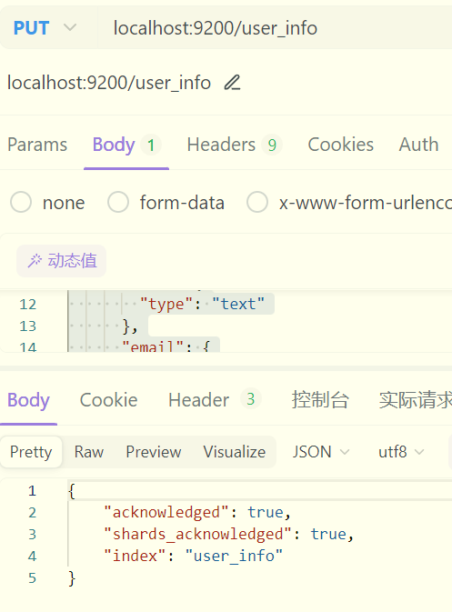
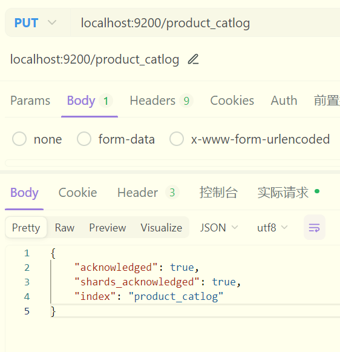
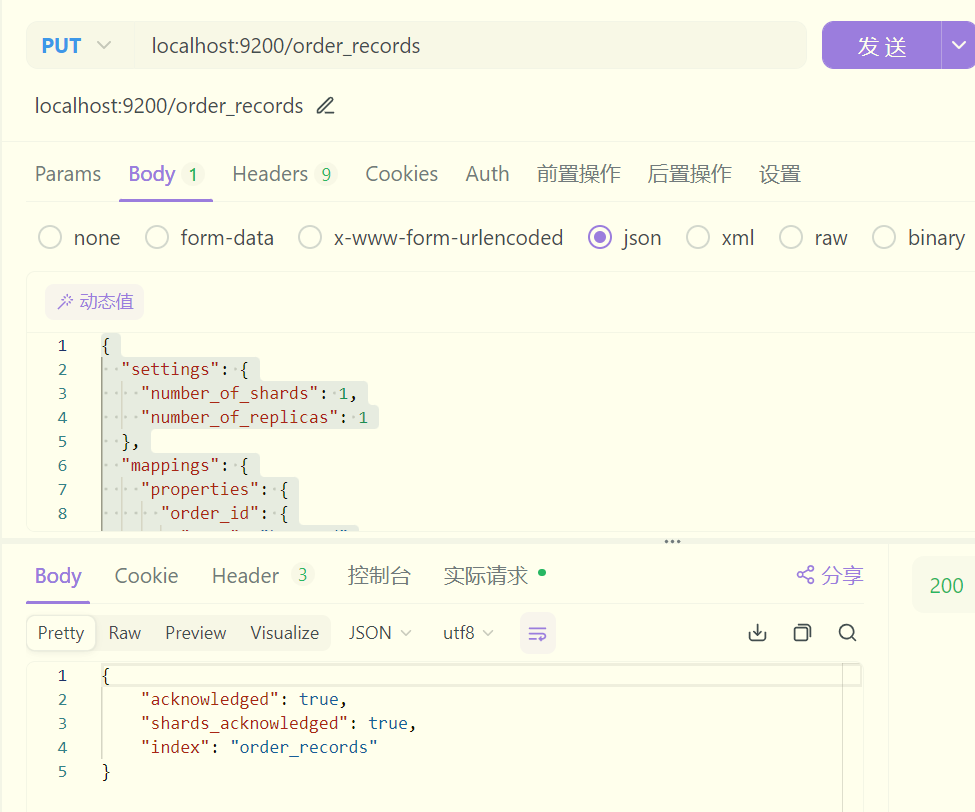
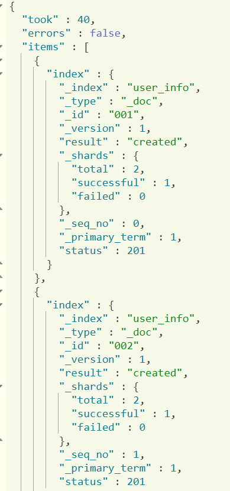

# **《实验二：索引&文档操作》**

**学院：省级示范性软件学院**

**题目：**《实验二：索引操作与文档操作练习》

**姓名：**陈冰琰

**学号：**2000770164

**班级：**软工2202

**日期：**2024-09-14

**实验环境：**Elasticsearch7.9.0 Kibana7.9.0


## 一、实验目的

1. 掌握Elasticsearch 安装IK分词器安装方法

2. 掌握Elasticsearch 索引操作方法

3. 掌握Elasticsearch 文档操作训练

4. 掌握Elasticsearch 高级查询与DSL训练

   

## 二、实验内容

1. Elasticsearch 安装IK分词器

2. Elasticsearch 索引操作训练

3. Elasticsearch 文档操作训练

4. Elasticsearch 高级查询与DSL训练

   

## 三、实验步骤

### 1. 索引操作练习

#### 1.1. 用户信息 (User Information) 索引

代码：

```json
{
  "settings": {
    "number_of_shards": 1,
    "number_of_replicas": 1
  },
  "mappings": {
    "properties": {
      "user_id": {
        "type": "keyword"
      },
      "name": {
        "type": "text"
      },
      "email": {
        "type": "keyword"
      },
      "date_of_birth": {
        "type": "date"
      },
      "gender": {
        "type":"keyword"
      },
      "address":{
        "type":"text"
      },
      "phone_number":{
        "type":"keyword"
      },
      "registration_date":{
        "type":"date"
      },
      "last_login":{
        "type":"date"
      },
      "status":{
        "type":"keyword"
      }
    }
  }
}
```

截图：



说明：开了护眼模式所以截图是黄的

#### 1.2. 产品目录 (Product Catalog) 索引

代码：

```json
{
  "settings": {
    "number_of_shards": 1,
    "number_of_replicas": 1
  },
  "mappings": {
    "properties": {
      "product_id": {
        "type": "keyword"
      },
      "name": {
        "type": "text"
      },
      "discription": {
        "type": "text"
      },
      "category": {
        "type": "keyword"
      },
      "price":{
        "type":"double"
      },
      "stock_quantity":{
        "type":"integer"
      },
      "supplier":{
        "type":"keyword"
      },
      "release_date":{
        "type":"date"
      },
      "tags":{
        "type":"keyword"
      },
      "rating":{
        "type":"float"
      }
    }
  }
}
```

截图：



说明：无

#### 1.3. 订单记录 (Order Records) 索引字段描述

代码：

```json
{
  "settings": {
    "number_of_shards": 1,
    "number_of_replicas": 1
  },
  "mappings": {
    "properties": {
      "order_id": {
        "type": "keyword"
      },
      "customer_id": {
        "type": "keyword"
      },
      "order_date": {
        "type": "date"
      },
      "status": {
        "type": "keyword"
      },
      "total_amount":{
        "type":"double"
      },
      "items":{
        "type":"nested",
            "properties":{
                "product_id":{
                    "type":"keyword"
                },
                "quantity":{
                    "type":"integer"
                },
                "price":{
                    "type":"double"
                }
            }
      },
      "shipping_address":{
        "type":"text"
      },
      "payment_method":{
        "type":"keyword"
      },
      "shipping_date":{
        "type":"date"
      },
      "delivery_date":{
        "type":"date"
      }
    }
  }
}
```

截图：



说明：无


### 2. 文档操作练习

#### 2.1. 批量插入用户信息数据

代码：

```json
POST /user_info/_bulk
{ "index": { "_id": "001" } }
{ "user_id": "001", "name": "Alice Johnson", "email": "alice.johnson@example.com", "date_of_birth": "1990-05-15", "gender": "female", "address": "123 Main St, Anytown, USA", "phone_number": "123-456-7890", "registration_date": "2023-01-15", "last_login": "2024-09-01", "status": "active" }
{ "index": { "_id": "002" } }
{ "user_id": "002", "name": "Bob Smith", "email": "bob.smith@example.com", "date_of_birth": "1985-08-20", "gender": "male", "address": "456 Elm St, Othertown, USA", "phone_number": "234-567-8901", "registration_date": "2023-02-20", "last_login": "2024-08-25", "status": "active" }
{ "index": { "_id": "003" } }
{ "user_id": "003", "name": "Charlie Brown", "email": "charlie.brown@example.com", "date_of_birth": "1992-11-30", "gender": "male", "address": "789 Maple Ave, Sometown, USA", "phone_number": "345-678-9012", "registration_date": "2023-03-10", "last_login": "2024-09-05", "status": "inactive" }
{ "index": { "_id": "004" } }
{ "user_id": "004", "name": "David Wilson", "email": "david.wilson@example.com", "date_of_birth": "1988-02-14", "gender": "male", "address": "101 Oak St, Anycity, USA", "phone_number": "456-789-0123", "registration_date": "2023-04-05", "last_login": "2024-08-30", "status": "active" }
{ "index": { "_id": "005" } }
{ "user_id": "005", "name": "Eve Davis", "email": "eve.davis@example.com", "date_of_birth": "1995-07-22", "gender": "female", "address": "202 Pine St, Otherville, USA", "phone_number": "567-890-1234", "registration_date": "2023-05-18", "last_login": "2024-09-02", "status": "active" }
{ "index": { "_id": "006" } }
{ "user_id": "006", "name": "Frank Miller", "email": "frank.miller@example.com", "date_of_birth": "1991-10-05", "gender": "male", "address": "303 Cedar Rd, Newtown, USA", "phone_number": "678-901-2345", "registration_date": "2023-06-22", "last_login": "2024-09-03", "status": "active" }
{ "index": { "_id": "007" } }
{ "user_id": "007", "name": "Grace Lee", "email": "grace.lee@example.com", "date_of_birth": "1989-04-17", "gender": "female", "address": "404 Birch Ln, Oldtown, USA", "phone_number": "789-012-3456", "registration_date": "2023-07-30", "last_login": "2024-09-04", "status": "inactive" }
{ "index": { "_id": "008" } }
{ "user_id": "008", "name": "Hannah White", "email": "hannah.white@example.com", "date_of_birth": "1993-12-25", "gender": "female", "address": "505 Spruce St, Littletown, USA", "phone_number": "890-123-4567", "registration_date": "2023-08-15", "last_login": "2024-09-06", "status": "active" }
{ "index": { "_id": "009" } }
{ "user_id": "009", "name": "Ivy Green", "email": "ivy.green@example.com", "date_of_birth": "1994-03-03", "gender": "female", "address": "606 Willow Ave, Bigcity, USA", "phone_number": "901-234-5678", "registration_date": "2023-09-01", "last_login": "2024-09-07", "status": "active" }
{ "index": { "_id": "010" } }
{ "user_id": "010", "name": "Jack Black", "email": "jack.black@example.com", "date_of_birth": "1987-06-18", "gender": "male", "address": "707 Poplar Dr, Smalltown, USA", "phone_number": "012-345-6789", "registration_date": "2023-10-10", "last_login": "2024-09-08", "status": "inactive" }
{ "index": { "_id": "011" } }
{ "user_id": "011", "name": "Karen Adams", "email": "karen.adams@example.com", "date_of_birth": "1990-09-21", "gender": "female", "address": "808 Chestnut Blvd, Metropolis, USA", "phone_number": "123-456-7890", "registration_date": "2023-11-25", "last_login": "2024-09-09", "status": "active" }
{ "index": { "_id": "012" } }
{ "user_id": "012", "name": "Leo King", "email": "leo.king@example.com", "date_of_birth": "1986-01-12", "gender": "male", "address": "909 Ash Ct, Villagetown, USA", "phone_number": "234-567-8901", "registration_date": "2023-12-05", "last_login": "2024-09-10", "status": "active" }
{ "index": { "_id": "013" } }
{ "user_id": "013", "name": "Mia Moore", "email": "mia.moore@example.com", "date_of_birth": "1992-02-28", "gender": "female", "address": "1010 Fir Ln, Hamlet, USA", "phone_number": "345-678-9012", "registration_date": "2024-01-10", "last_login": "2024-09-11", "status": "inactive" }
{ "index": { "_id": "014" } }
{ "user_id": "014", "name": "Nina Scott", "email": "nina.scott@example.com", "date_of_birth": "1988-05-05", "gender": "female", "address": "1111 Cypress St, Township, USA", "phone_number": "456-789-0123", "registration_date": "2024-02-14", "last_login": "2024-09-12", "status": "active" }
{ "index": { "_id": "015" } }
{ "user_id": "015", "name": "Oscar Turner", "email": "oscar.turner@example.com", "date_of_birth": "1991-07-19", "gender": "male", "address": "1212 Redwood Rd, Cityville, USA", "phone_number": "567-890-1234", "registration_date": "2024-03-20", "last_login": "2024-09-13", "status": "active" }
{ "index": { "_id": "016" } }
{ "user_id": "016", "name": "Paul Walker", "email": "paul.walker@example.com", "date_of_birth": "1989-10-10", "gender": "male", "address": "1313 Cherry Ave, Urbantown, USA", "phone_number": "678-901-2345", "registration_date": "2024-04-25", "last_login": "2024-09-14", "status": "inactive" }
{ "index": { "_id": "017" } }
{ "user_id": "017", "name": "Quinn Hughes", "email": "quinn.hughes@example.com", "date_of_birth": "1993-11-11", "gender": "male", "address": "1414 Beech St, Suburbia, USA", "phone_number": "789-012-3456", "registration_date": "2024-05-30", "last_login": "2024-09-15", "status": "active" }
{ "index": { "_id": "018" } }
{ "user_id": "018", "name": "Rose Hall", "email": "rose.hall@example.com", "date_of_birth": "1990-03-22", "gender": "female", "address": "1515 Palm Dr, Downtown, USA", "phone_number": "890-123-4567", "registration_date": "2024-06-15", "last_login": "2024-09-16", "status": "active" }
{ "index": { "_id": "019" } }
{ "user_id": "019", "name": "Steve Young", "email": "steve.young@example.com", "date_of_birth": "1987-09-09", "gender": "male", "address": "1616 Pine St, Uptown, USA", "phone_number": "901-234-5678", "registration_date": "2024-07-20", "last_login": "2024-09-17", "status": "inactive" }
{ "index": { "_id": "020" } }
{ "user_id": "020", "name": "Tina Brown", "email": "tina.brown@example.com", "date_of_birth": "1994-12-12", "gender": "female", "address": "1717 Maple Ave, Seaside, USA", "phone_number": "012-345-6789", "registration_date": "2024-08-10", "last_login": "2024-09-18", "status": "active" }
```


截图：



因长截图限制，剩下的运行结果用代码块展示：（后续返回结果都用代码块展示）

```json
{
  "took" : 40,
  "errors" : false,
  "items" : [
    {
      "index" : {
        "_index" : "user_info",
        "_type" : "_doc",
        "_id" : "001",
        "_version" : 1,
        "result" : "created",
        "_shards" : {
          "total" : 2,
          "successful" : 1,
          "failed" : 0
        },
        "_seq_no" : 0,
        "_primary_term" : 1,
        "status" : 201
      }
    },
    {
      "index" : {
        "_index" : "user_info",
        "_type" : "_doc",
        "_id" : "002",
        "_version" : 1,
        "result" : "created",
        "_shards" : {
          "total" : 2,
          "successful" : 1,
          "failed" : 0
        },
        "_seq_no" : 1,
        "_primary_term" : 1,
        "status" : 201
      }
    },
    {
      "index" : {
        "_index" : "user_info",
        "_type" : "_doc",
        "_id" : "003",
        "_version" : 1,
        "result" : "created",
        "_shards" : {
          "total" : 2,
          "successful" : 1,
          "failed" : 0
        },
        "_seq_no" : 2,
        "_primary_term" : 1,
        "status" : 201
      }
    },
    {
      "index" : {
        "_index" : "user_info",
        "_type" : "_doc",
        "_id" : "004",
        "_version" : 1,
        "result" : "created",
        "_shards" : {
          "total" : 2,
          "successful" : 1,
          "failed" : 0
        },
        "_seq_no" : 3,
        "_primary_term" : 1,
        "status" : 201
      }
    },
    {
      "index" : {
        "_index" : "user_info",
        "_type" : "_doc",
        "_id" : "005",
        "_version" : 1,
        "result" : "created",
        "_shards" : {
          "total" : 2,
          "successful" : 1,
          "failed" : 0
        },
        "_seq_no" : 4,
        "_primary_term" : 1,
        "status" : 201
      }
    },
    {
      "index" : {
        "_index" : "user_info",
        "_type" : "_doc",
        "_id" : "006",
        "_version" : 1,
        "result" : "created",
        "_shards" : {
          "total" : 2,
          "successful" : 1,
          "failed" : 0
        },
        "_seq_no" : 5,
        "_primary_term" : 1,
        "status" : 201
      }
    },
    {
      "index" : {
        "_index" : "user_info",
        "_type" : "_doc",
        "_id" : "007",
        "_version" : 1,
        "result" : "created",
        "_shards" : {
          "total" : 2,
          "successful" : 1,
          "failed" : 0
        },
        "_seq_no" : 6,
        "_primary_term" : 1,
        "status" : 201
      }
    },
    {
      "index" : {
        "_index" : "user_info",
        "_type" : "_doc",
        "_id" : "008",
        "_version" : 1,
        "result" : "created",
        "_shards" : {
          "total" : 2,
          "successful" : 1,
          "failed" : 0
        },
        "_seq_no" : 7,
        "_primary_term" : 1,
        "status" : 201
      }
    },
    {
      "index" : {
        "_index" : "user_info",
        "_type" : "_doc",
        "_id" : "009",
        "_version" : 1,
        "result" : "created",
        "_shards" : {
          "total" : 2,
          "successful" : 1,
          "failed" : 0
        },
        "_seq_no" : 8,
        "_primary_term" : 1,
        "status" : 201
      }
    },
    {
      "index" : {
        "_index" : "user_info",
        "_type" : "_doc",
        "_id" : "010",
        "_version" : 1,
        "result" : "created",
        "_shards" : {
          "total" : 2,
          "successful" : 1,
          "failed" : 0
        },
        "_seq_no" : 9,
        "_primary_term" : 1,
        "status" : 201
      }
    },
    {
      "index" : {
        "_index" : "user_info",
        "_type" : "_doc",
        "_id" : "011",
        "_version" : 1,
        "result" : "created",
        "_shards" : {
          "total" : 2,
          "successful" : 1,
          "failed" : 0
        },
        "_seq_no" : 10,
        "_primary_term" : 1,
        "status" : 201
      }
    },
    {
      "index" : {
        "_index" : "user_info",
        "_type" : "_doc",
        "_id" : "012",
        "_version" : 1,
        "result" : "created",
        "_shards" : {
          "total" : 2,
          "successful" : 1,
          "failed" : 0
        },
        "_seq_no" : 11,
        "_primary_term" : 1,
        "status" : 201
      }
    },
    {
      "index" : {
        "_index" : "user_info",
        "_type" : "_doc",
        "_id" : "013",
        "_version" : 1,
        "result" : "created",
        "_shards" : {
          "total" : 2,
          "successful" : 1,
          "failed" : 0
        },
        "_seq_no" : 12,
        "_primary_term" : 1,
        "status" : 201
      }
    },
    {
      "index" : {
        "_index" : "user_info",
        "_type" : "_doc",
        "_id" : "014",
        "_version" : 1,
        "result" : "created",
        "_shards" : {
          "total" : 2,
          "successful" : 1,
          "failed" : 0
        },
        "_seq_no" : 13,
        "_primary_term" : 1,
        "status" : 201
      }
    },
    {
      "index" : {
        "_index" : "user_info",
        "_type" : "_doc",
        "_id" : "015",
        "_version" : 1,
        "result" : "created",
        "_shards" : {
          "total" : 2,
          "successful" : 1,
          "failed" : 0
        },
        "_seq_no" : 14,
        "_primary_term" : 1,
        "status" : 201
      }
    },
    {
      "index" : {
        "_index" : "user_info",
        "_type" : "_doc",
        "_id" : "016",
        "_version" : 1,
        "result" : "created",
        "_shards" : {
          "total" : 2,
          "successful" : 1,
          "failed" : 0
        },
        "_seq_no" : 15,
        "_primary_term" : 1,
        "status" : 201
      }
    },
    {
      "index" : {
        "_index" : "user_info",
        "_type" : "_doc",
        "_id" : "017",
        "_version" : 1,
        "result" : "created",
        "_shards" : {
          "total" : 2,
          "successful" : 1,
          "failed" : 0
        },
        "_seq_no" : 16,
        "_primary_term" : 1,
        "status" : 201
      }
    },
    {
      "index" : {
        "_index" : "user_info",
        "_type" : "_doc",
        "_id" : "018",
        "_version" : 1,
        "result" : "created",
        "_shards" : {
          "total" : 2,
          "successful" : 1,
          "failed" : 0
        },
        "_seq_no" : 17,
        "_primary_term" : 1,
        "status" : 201
      }
    },
    {
      "index" : {
        "_index" : "user_info",
        "_type" : "_doc",
        "_id" : "019",
        "_version" : 1,
        "result" : "created",
        "_shards" : {
          "total" : 2,
          "successful" : 1,
          "failed" : 0
        },
        "_seq_no" : 18,
        "_primary_term" : 1,
        "status" : 201
      }
    },
    {
      "index" : {
        "_index" : "user_info",
        "_type" : "_doc",
        "_id" : "020",
        "_version" : 1,
        "result" : "created",
        "_shards" : {
          "total" : 2,
          "successful" : 1,
          "failed" : 0
        },
        "_seq_no" : 19,
        "_primary_term" : 1,
        "status" : 201
      }
    }
  ]
}

```

说明：应该使用压缩后的json语句在kibana中进行操作

#### 2.2. 批量插入产品目录数据

代码：

```json
POST /product_catlog/_bulk
{ "index": { "_id": "001" } }
{"product_id": "P001","name": "Wireless Mouse","description": "A high precision wireless mouse with ergonomic design.","category": "Electronics","price": 29.99,"stock_quantity": 150,"supplier": "TechCorp","release_date": "2023-01-15","tags": ["wireless", "mouse", "electronics"],"rating": 4.5}
{ "index": { "_id": "002" } }
{"product_id": "P002","name": "Bluetooth Speaker","description": "Portable Bluetooth speaker with excellent sound quality.","category": "Audio","price": 49.99,"stock_quantity": 200,"supplier": "SoundWave","release_date": "2023-02-20","tags": ["bluetooth", "speaker", "audio"],"rating": 4.7}
{ "index": { "_id": "003" } }
{"product_id": "P003","name": "Smartphone Stand","description": "Adjustable smartphone stand for hands-free viewing.","category": "Accessories","price": 15.99,"stock_quantity": 300,"supplier": "GadgetPlus","release_date": "2023-03-10","tags": ["smartphone", "stand", "accessories"],"rating": 4.3}
{ "index": { "_id": "004" } }
{"product_id": "P004","name": "USB-C Charger","description": "Fast charging USB-C charger compatible with most devices.","category": "Chargers","price": 19.99,"stock_quantity": 250,"supplier": "ChargeMaster","release_date": "2023-04-05","tags": ["usb-c", "charger", "electronics"],"rating": 4.6}
{ "index": { "_id": "005" } }
{"product_id": "P005","name": "Noise Cancelling Headphones","description": "Over-ear headphones with active noise cancellation.","category": "Audio","price": 89.99,"stock_quantity": 100,"supplier": "AudioTech","release_date": "2023-05-18","tags": ["noise cancelling", "headphones", "audio"],"rating": 4.8}
{ "index": { "_id": "006" } }
{"product_id": "P006","name": "4K Monitor","description": "Ultra HD 4K monitor with stunning display quality.","category": "Monitors","price": 299.99,"stock_quantity": 80,"supplier": "ViewPerfect","release_date": "2023-06-22","tags": ["4k", "monitor", "electronics"],"rating": 4.9}
{ "index": { "_id": "007" } }
{"product_id": "P007","name": "Gaming Keyboard","description": "Mechanical keyboard with customizable RGB lighting.","category": "Gaming","price": 59.99,"stock_quantity": 120,"supplier": "GameGear","release_date": "2023-07-30","tags": ["gaming", "keyboard", "electronics"],"rating": 4.4}
{ "index": { "_id": "008" } }
{"product_id": "P008","name": "Fitness Tracker","description": "Smart fitness tracker with heart rate monitor.","category": "Wearables","price": 39.99,"stock_quantity": 180,"supplier": "FitLife","release_date": "2023-08-15","tags": ["fitness", "tracker", "wearables"],"rating": 4.2}
{ "index": { "_id": "009" } }
{"product_id": "P009","name": "Electric Toothbrush","description": "Rechargeable electric toothbrush with multiple modes.","category": "Personal Care","price": 34.99,"stock_quantity": 140,"supplier": "SmileBright","release_date": "2023-09-01","tags": ["electric", "toothbrush", "personal care"],"rating": 4.5}
{ "index": { "_id": "010" } }
{"product_id": "P010","name": "Smart Thermostat","description": "Wi-Fi enabled smart thermostat with energy saving features.","category": "Home Automation","price": 129.99,"stock_quantity": 90,"supplier": "HomeSmart","release_date": "2023-10-10","tags": ["smart", "thermostat", "home automation"],"rating": 4.7}
{ "index": { "_id": "011" } }
{"product_id": "P011","name": "LED Desk Lamp","description": "Adjustable LED desk lamp with touch control.","category": "Lighting","price": 24.99,"stock_quantity": 160,"supplier": "BrightLight","release_date": "2023-11-25","tags": ["led", "desk lamp", "lighting"],"rating": 4.3}
{ "index": { "_id": "012" } }
{"product_id": "P012","name": "Portable Hard Drive","description": "1TB portable hard drive with fast data transfer.","category": "Storage","price": 64.99,"stock_quantity": 110,"supplier": "DataSafe","release_date": "2023-12-05","tags": ["portable", "hard drive", "storage"],"rating": 4.6}
{ "index": { "_id": "013" } }
{"product_id": "P013","name": "Coffee Maker","description": "Automatic coffee maker with programmable settings.","category": "Kitchen Appliances","price": 79.99,"stock_quantity": 130,"supplier": "BrewMaster","release_date": "2024-01-10","tags": ["coffee", "maker", "appliances"],"rating": 4.4}
{ "index": { "_id": "014" } }
{"product_id": "P014","name": "Smart Light Bulb","description": "Color changing smart light bulb with app control.","category": "Lighting","price": 14.99,"stock_quantity": 220,"supplier": "LightSmart","release_date": "2024-02-14","tags": ["smart", "light bulb", "lighting"],"rating": 4.2}
{ "index": { "_id": "015" } }
{"product_id": "P015","name": "Electric Kettle","description": "Quick boil electric kettle with auto shut-off.","category": "Kitchen Appliances","price": 29.99,"stock_quantity": 170,"supplier": "QuickBoil","release_date": "2024-03-20","tags": ["electric", "kettle", "appliances"],"rating": 4.5}
{ "index": { "_id": "016" } }
{"product_id": "P016","name": "Robot Vacuum","description": "Smart robot vacuum cleaner with scheduling features.","category": "Home Appliances","price": 199.99,"stock_quantity": 60,"supplier": "CleanBot","release_date": "2024-04-25","tags": ["robot", "vacuum", "home appliances"],"rating": 4.8}
{ "index": { "_id": "017" } }
{"product_id": "P017","name": "Digital Camera","description": "Compact digital camera with high resolution.","category": "Photography","price": 149.99,"stock_quantity": 95,"supplier": "PhotoSnap","release_date": "2024-05-30","tags": ["digital", "camera", "photography"],"rating": 4.7}
{ "index": { "_id": "018" } }
{"product_id": "P018","name": "Smartwatch","description": "Feature-rich smartwatch with fitness tracking.","category": "Wearables","price": 99.99,"stock_quantity": 140,"supplier": "WristTech","release_date": "2024-06-15","tags": ["smartwatch", "wearables", "fitness"],"rating": 4.4}
{ "index": { "_id": "019" } }
{"product_id": "P019","name": "Air Fryer","description": "Healthier cooking with a digital air fryer.","category": "Kitchen Appliances","price": 89.99,"stock_quantity": 115,"supplier": "HealthyCook","release_date": "2024-07-20","tags": ["air fryer", "kitchen", "appliances"],"rating": 4.6}
{ "index": { "_id": "020" } }
{"product_id": "P020","name": "Electric Scooter","description": "Eco-friendly electric scooter with long battery life.","category": "Transportation","price": 299.99,"stock_quantity": 50,"supplier": "EcoRide","release_date": "2024-08-10","tags": ["electric", "scooter", "transportation"],"rating": 4.7}
```

返回结果：

```json
{
  "took" : 121,
  "errors" : false,
  "items" : [
    {
      "index" : {
        "_index" : "product_catlog",
        "_type" : "_doc",
        "_id" : "001",
        "_version" : 1,
        "result" : "created",
        "_shards" : {
          "total" : 2,
          "successful" : 1,
          "failed" : 0
        },
        "_seq_no" : 0,
        "_primary_term" : 1,
        "status" : 201
      }
    },
    {
      "index" : {
        "_index" : "product_catlog",
        "_type" : "_doc",
        "_id" : "002",
        "_version" : 1,
        "result" : "created",
        "_shards" : {
          "total" : 2,
          "successful" : 1,
          "failed" : 0
        },
        "_seq_no" : 1,
        "_primary_term" : 1,
        "status" : 201
      }
    },
    {
      "index" : {
        "_index" : "product_catlog",
        "_type" : "_doc",
        "_id" : "003",
        "_version" : 1,
        "result" : "created",
        "_shards" : {
          "total" : 2,
          "successful" : 1,
          "failed" : 0
        },
        "_seq_no" : 2,
        "_primary_term" : 1,
        "status" : 201
      }
    },
    {
      "index" : {
        "_index" : "product_catlog",
        "_type" : "_doc",
        "_id" : "004",
        "_version" : 1,
        "result" : "created",
        "_shards" : {
          "total" : 2,
          "successful" : 1,
          "failed" : 0
        },
        "_seq_no" : 3,
        "_primary_term" : 1,
        "status" : 201
      }
    },
    {
      "index" : {
        "_index" : "product_catlog",
        "_type" : "_doc",
        "_id" : "005",
        "_version" : 1,
        "result" : "created",
        "_shards" : {
          "total" : 2,
          "successful" : 1,
          "failed" : 0
        },
        "_seq_no" : 4,
        "_primary_term" : 1,
        "status" : 201
      }
    },
    {
      "index" : {
        "_index" : "product_catlog",
        "_type" : "_doc",
        "_id" : "006",
        "_version" : 1,
        "result" : "created",
        "_shards" : {
          "total" : 2,
          "successful" : 1,
          "failed" : 0
        },
        "_seq_no" : 5,
        "_primary_term" : 1,
        "status" : 201
      }
    },
    {
      "index" : {
        "_index" : "product_catlog",
        "_type" : "_doc",
        "_id" : "007",
        "_version" : 1,
        "result" : "created",
        "_shards" : {
          "total" : 2,
          "successful" : 1,
          "failed" : 0
        },
        "_seq_no" : 6,
        "_primary_term" : 1,
        "status" : 201
      }
    },
    {
      "index" : {
        "_index" : "product_catlog",
        "_type" : "_doc",
        "_id" : "008",
        "_version" : 1,
        "result" : "created",
        "_shards" : {
          "total" : 2,
          "successful" : 1,
          "failed" : 0
        },
        "_seq_no" : 7,
        "_primary_term" : 1,
        "status" : 201
      }
    },
    {
      "index" : {
        "_index" : "product_catlog",
        "_type" : "_doc",
        "_id" : "009",
        "_version" : 1,
        "result" : "created",
        "_shards" : {
          "total" : 2,
          "successful" : 1,
          "failed" : 0
        },
        "_seq_no" : 8,
        "_primary_term" : 1,
        "status" : 201
      }
    },
    {
      "index" : {
        "_index" : "product_catlog",
        "_type" : "_doc",
        "_id" : "010",
        "_version" : 1,
        "result" : "created",
        "_shards" : {
          "total" : 2,
          "successful" : 1,
          "failed" : 0
        },
        "_seq_no" : 9,
        "_primary_term" : 1,
        "status" : 201
      }
    },
    {
      "index" : {
        "_index" : "product_catlog",
        "_type" : "_doc",
        "_id" : "011",
        "_version" : 1,
        "result" : "created",
        "_shards" : {
          "total" : 2,
          "successful" : 1,
          "failed" : 0
        },
        "_seq_no" : 10,
        "_primary_term" : 1,
        "status" : 201
      }
    },
    {
      "index" : {
        "_index" : "product_catlog",
        "_type" : "_doc",
        "_id" : "012",
        "_version" : 1,
        "result" : "created",
        "_shards" : {
          "total" : 2,
          "successful" : 1,
          "failed" : 0
        },
        "_seq_no" : 11,
        "_primary_term" : 1,
        "status" : 201
      }
    },
    {
      "index" : {
        "_index" : "product_catlog",
        "_type" : "_doc",
        "_id" : "013",
        "_version" : 1,
        "result" : "created",
        "_shards" : {
          "total" : 2,
          "successful" : 1,
          "failed" : 0
        },
        "_seq_no" : 12,
        "_primary_term" : 1,
        "status" : 201
      }
    },
    {
      "index" : {
        "_index" : "product_catlog",
        "_type" : "_doc",
        "_id" : "014",
        "_version" : 1,
        "result" : "created",
        "_shards" : {
          "total" : 2,
          "successful" : 1,
          "failed" : 0
        },
        "_seq_no" : 13,
        "_primary_term" : 1,
        "status" : 201
      }
    },
    {
      "index" : {
        "_index" : "product_catlog",
        "_type" : "_doc",
        "_id" : "015",
        "_version" : 1,
        "result" : "created",
        "_shards" : {
          "total" : 2,
          "successful" : 1,
          "failed" : 0
        },
        "_seq_no" : 14,
        "_primary_term" : 1,
        "status" : 201
      }
    },
    {
      "index" : {
        "_index" : "product_catlog",
        "_type" : "_doc",
        "_id" : "016",
        "_version" : 1,
        "result" : "created",
        "_shards" : {
          "total" : 2,
          "successful" : 1,
          "failed" : 0
        },
        "_seq_no" : 15,
        "_primary_term" : 1,
        "status" : 201
      }
    },
    {
      "index" : {
        "_index" : "product_catlog",
        "_type" : "_doc",
        "_id" : "017",
        "_version" : 1,
        "result" : "created",
        "_shards" : {
          "total" : 2,
          "successful" : 1,
          "failed" : 0
        },
        "_seq_no" : 16,
        "_primary_term" : 1,
        "status" : 201
      }
    },
    {
      "index" : {
        "_index" : "product_catlog",
        "_type" : "_doc",
        "_id" : "018",
        "_version" : 1,
        "result" : "created",
        "_shards" : {
          "total" : 2,
          "successful" : 1,
          "failed" : 0
        },
        "_seq_no" : 17,
        "_primary_term" : 1,
        "status" : 201
      }
    },
    {
      "index" : {
        "_index" : "product_catlog",
        "_type" : "_doc",
        "_id" : "019",
        "_version" : 1,
        "result" : "created",
        "_shards" : {
          "total" : 2,
          "successful" : 1,
          "failed" : 0
        },
        "_seq_no" : 18,
        "_primary_term" : 1,
        "status" : 201
      }
    },
    {
      "index" : {
        "_index" : "product_catlog",
        "_type" : "_doc",
        "_id" : "020",
        "_version" : 1,
        "result" : "created",
        "_shards" : {
          "total" : 2,
          "successful" : 1,
          "failed" : 0
        },
        "_seq_no" : 19,
        "_primary_term" : 1,
        "status" : 201
      }
    }
  ]
}

```

说明：格式压缩 注意换行

#### 2.3.批量插入 订单记录数据

代码：

```json
POST /order_records/_bulk
{ "index": { "_id": "OR001" } }
{ "order_id": "OR001", "customer_id": "C001", "order_date": "2024-01-10", "status": "completed", "total_amount": 150.75, "items": [{ "product_id": "P001", "quantity": 2, "price": 50.00 }, { "product_id": "P002", "quantity": 1, "price": 50.75 }], "shipping_address": "123 Main St, Anytown, USA", "payment_method": "credit_card", "shipping_date": "2024-01-11", "delivery_date": "2024-01-15" }
{ "index": { "_id": "OR002" } }
{ "order_id": "OR002", "customer_id": "C002", "order_date": "2024-01-15", "status": "pending", "total_amount": 89.99, "items": [{ "product_id": "P003", "quantity": 1, "price": 89.99 }], "shipping_address": "456 Elm St, Othertown, USA", "payment_method": "paypal", "shipping_date": "2024-01-16", "delivery_date": "2024-01-20" }
{ "index": { "_id": "OR003" } }
{ "order_id": "OR003", "customer_id": "C003", "order_date": "2024-01-20", "status": "shipped", "total_amount": 120.50, "items": [{ "product_id": "P004", "quantity": 3, "price": 40.00 }], "shipping_address": "789 Maple Ave, Sometown, USA", "payment_method": "debit_card", "shipping_date": "2024-01-21", "delivery_date": "2024-01-25" }
{ "index": { "_id": "OR004" } }
{ "order_id": "OR004", "customer_id": "C004", "order_date": "2024-01-25", "status": "completed", "total_amount": 75.00, "items": [{ "product_id": "P005", "quantity": 5, "price": 15.00 }], "shipping_address": "101 Oak St, Anycity, USA", "payment_method": "credit_card", "shipping_date": "2024-01-26", "delivery_date": "2024-01-30" }
{ "index": { "_id": "OR005" } }
{ "order_id": "OR005", "customer_id": "C005", "order_date": "2024-02-01", "status": "cancelled", "total_amount": 200.00, "items": [{ "product_id": "P006", "quantity": 2, "price": 100.00 }], "shipping_address": "202 Pine St, Otherville, USA", "payment_method": "bank_transfer", "shipping_date": "2024-02-02", "delivery_date": "2024-02-06" }
{ "index": { "_id": "OR006" } }
{ "order_id": "OR006", "customer_id": "C006", "order_date": "2024-02-05", "status": "completed", "total_amount": 300.25, "items": [{ "product_id": "P007", "quantity": 1, "price": 300.25 }], "shipping_address": "303 Cedar Rd, Newtown, USA", "payment_method": "credit_card", "shipping_date": "2024-02-06", "delivery_date": "2024-02-10" }
{ "index": { "_id": "OR007" } }
{ "order_id": "OR007", "customer_id": "C007", "order_date": "2024-02-10", "status": "pending", "total_amount": 45.99, "items": [{ "product_id": "P008", "quantity": 3, "price": 15.33 }], "shipping_address": "404 Birch Ln, Oldtown, USA", "payment_method": "paypal", "shipping_date": "2024-02-11", "delivery_date": "2024-02-15" }
{ "index": { "_id": "OR008" } }
{ "order_id": "OR008", "customer_id": "C008", "order_date": "2024-02-15", "status": "shipped", "total_amount": 89.50, "items": [{ "product_id": "P009", "quantity": 2, "price": 44.75 }], "shipping_address": "505 Spruce St, Littletown, USA", "payment_method": "debit_card", "shipping_date": "2024-02-16", "delivery_date": "2024-02-20" }
{ "index": { "_id": "OR009" } }
{ "order_id": "OR009", "customer_id": "C009", "order_date": "2024-02-20", "status": "completed", "total_amount": 60.00, "items": [{ "product_id": "P010", "quantity": 4, "price": 15.00 }], "shipping_address": "606 Willow Ave, Bigcity, USA", "payment_method": "credit_card", "shipping_date": "2024-02-21", "delivery_date": "2024-02-25" }
{ "index": { "_id": "OR010" } }
{ "order_id": "OR010", "customer_id": "C010", "order_date": "2024-02-25", "status": "cancelled", "total_amount": 150.00, "items": [{ "product_id": "P011", "quantity": 10, "price": 15.00 }], "shipping_address": "707 Poplar Dr, Smalltown, USA", "payment_method": "bank_transfer", "shipping_date": "2024-02-26", "delivery_date": "2024-03-01" }
{ "index": { "_id": "OR011" } }
{ "order_id": "OR011", "customer_id": "C011", "order_date": "2024-03-01", "status": "completed", "total_amount": 110.00, "items": [{ "product_id": "P012", "quantity": 2, "price": 55.00 }], "shipping_address": "808 Chestnut Blvd, Metropolis, USA", "payment_method": "credit_card", "shipping_date": "2024-03-02", "delivery_date": "2024-03-06" }
{ "index": { "_id": "OR012" } }
{ "order_id": "OR012", "customer_id": "C012", "order_date": "2024-03-05", "status": "pending", "total_amount": 75.99, "items": [{ "product_id": "P013", "quantity": 3, "price": 25.33 }], "shipping_address": "909 Ash Ct, Villagetown, USA", "payment_method": "paypal", "shipping_date": "2024-03-06", "delivery_date": "2024-03-10" }
{ "index": { "_id": "OR013" } }
{ "order_id": "OR013", "customer_id": "C013", "order_date": "2024-03-10", "status": "shipped", "total_amount": 200.00, "items": [{ "product_id": "P014", "quantity": 4, "price": 50.00 }], "shipping_address": "1010 Fir Ln, Hamlet, USA", "payment_method": "debit_card", "shipping_date": "2024-03-11", "delivery_date": "2024-03-15" }
{ "index": { "_id": "OR014" } }
{ "order_id": "OR014", "customer_id": "C014", "order_date": "2024-03-15", "status": "completed", "total_amount": 90.00, "items": [{ "product_id": "P015", "quantity": 6, "price": 15.00 }], "shipping_address": "1111 Cypress St, Township, USA", "payment_method": "credit_card", "shipping_date": "2024-03-16", "delivery_date": "2024-03-20" }
{ "index": { "_id": "OR015" } }
{ "order_id": "OR015", "customer_id": "C015", "order_date": "2024-03-20", "status": "cancelled", "total_amount": 135.00, "items": [{ "product_id": "P016", "quantity": 9, "price": 15.00 }], "shipping_address": "1212 Redwood Rd, Cityville, USA", "payment_method": "bank_transfer", "shipping_date": "2024-03-21", "delivery_date": "2024-03-25" }
{ "index": { "_id": "OR016" } }
{ "order_id": "OR016", "customer_id": "C016", "order_date": "2024-03-25", "status": "completed", "total_amount": 250.00, "items": [{ "product_id": "P017", "quantity": 5, "price": 50.00 }], "shipping_address": "1313 Cherry Ave, Urbantown, USA", "payment_method": "credit_card", "shipping_date": "2024-03-26", "delivery_date": "2024-03-30" }
{ "index": { "_id": "OR017" } }
{ "order_id": "OR017", "customer_id": "C017", "order_date": "2024-03-30", "status": "pending", "total_amount": 60.00, "items": [{ "product_id": "P018", "quantity": 2, "price": 30.00 }], "shipping_address": "1414 Beech St, Suburbia, USA", "payment_method": "paypal", "shipping_date": "2024-03-31", "delivery_date": "2024-04-04" }
{ "index": { "_id": "OR018" } }
{ "order_id": "OR018", "customer_id": "C018", "order_date": "2024-04-04", "status": "shipped", "total_amount": 100.00, "items": [{ "product_id": "P019", "quantity": 4, "price": 25.00 }], "shipping_address": "1515 Palm Dr, Downtown, USA", "payment_method": "debit_card", "shipping_date": "2024-04-05", "delivery_date": "2024-04-09" }
{ "index": { "_id": "OR019" } }
{ "order_id": "OR019", "customer_id": "C019", "order_date": "2024-04-09", "status": "completed", "total_amount": 180.00, "items": [{ "product_id": "P020", "quantity": 6, "price": 30.00 }], "shipping_address": "1616 Pine St, Uptown, USA", "payment_method": "credit_card", "shipping_date": "2024-04-10", "delivery_date": "2024-04-14" }
{ "index": { "_id": "OR020" } }
{ "order_id": "OR020", "customer_id": "C020", "order_date": "2024-04-14", "status": "cancelled", "total_amount": 220.00, "items": [{ "product_id": "P021", "quantity": 11, "price": 20.00 }], "shipping_address": "1717 Maple Ave, Seaside, USA", "payment_method": "bank_transfer", "shipping_date": "2024-04-15", "delivery_date": "2024-04-19" }
```

返回结果：

```json
{
  "took" : 21,
  "errors" : false,
  "items" : [
    {
      "index" : {
        "_index" : "order_records",
        "_type" : "_doc",
        "_id" : "OR001",
        "_version" : 1,
        "result" : "created",
        "_shards" : {
          "total" : 2,
          "successful" : 1,
          "failed" : 0
        },
        "_seq_no" : 0,
        "_primary_term" : 1,
        "status" : 201
      }
    },
    {
      "index" : {
        "_index" : "order_records",
        "_type" : "_doc",
        "_id" : "OR002",
        "_version" : 1,
        "result" : "created",
        "_shards" : {
          "total" : 2,
          "successful" : 1,
          "failed" : 0
        },
        "_seq_no" : 1,
        "_primary_term" : 1,
        "status" : 201
      }
    },
    {
      "index" : {
        "_index" : "order_records",
        "_type" : "_doc",
        "_id" : "OR003",
        "_version" : 1,
        "result" : "created",
        "_shards" : {
          "total" : 2,
          "successful" : 1,
          "failed" : 0
        },
        "_seq_no" : 2,
        "_primary_term" : 1,
        "status" : 201
      }
    },
    {
      "index" : {
        "_index" : "order_records",
        "_type" : "_doc",
        "_id" : "OR004",
        "_version" : 1,
        "result" : "created",
        "_shards" : {
          "total" : 2,
          "successful" : 1,
          "failed" : 0
        },
        "_seq_no" : 3,
        "_primary_term" : 1,
        "status" : 201
      }
    },
    {
      "index" : {
        "_index" : "order_records",
        "_type" : "_doc",
        "_id" : "OR005",
        "_version" : 1,
        "result" : "created",
        "_shards" : {
          "total" : 2,
          "successful" : 1,
          "failed" : 0
        },
        "_seq_no" : 4,
        "_primary_term" : 1,
        "status" : 201
      }
    },
    {
      "index" : {
        "_index" : "order_records",
        "_type" : "_doc",
        "_id" : "OR006",
        "_version" : 1,
        "result" : "created",
        "_shards" : {
          "total" : 2,
          "successful" : 1,
          "failed" : 0
        },
        "_seq_no" : 5,
        "_primary_term" : 1,
        "status" : 201
      }
    },
    {
      "index" : {
        "_index" : "order_records",
        "_type" : "_doc",
        "_id" : "OR007",
        "_version" : 1,
        "result" : "created",
        "_shards" : {
          "total" : 2,
          "successful" : 1,
          "failed" : 0
        },
        "_seq_no" : 6,
        "_primary_term" : 1,
        "status" : 201
      }
    },
    {
      "index" : {
        "_index" : "order_records",
        "_type" : "_doc",
        "_id" : "OR008",
        "_version" : 1,
        "result" : "created",
        "_shards" : {
          "total" : 2,
          "successful" : 1,
          "failed" : 0
        },
        "_seq_no" : 7,
        "_primary_term" : 1,
        "status" : 201
      }
    },
    {
      "index" : {
        "_index" : "order_records",
        "_type" : "_doc",
        "_id" : "OR009",
        "_version" : 1,
        "result" : "created",
        "_shards" : {
          "total" : 2,
          "successful" : 1,
          "failed" : 0
        },
        "_seq_no" : 8,
        "_primary_term" : 1,
        "status" : 201
      }
    },
    {
      "index" : {
        "_index" : "order_records",
        "_type" : "_doc",
        "_id" : "OR010",
        "_version" : 1,
        "result" : "created",
        "_shards" : {
          "total" : 2,
          "successful" : 1,
          "failed" : 0
        },
        "_seq_no" : 9,
        "_primary_term" : 1,
        "status" : 201
      }
    },
    {
      "index" : {
        "_index" : "order_records",
        "_type" : "_doc",
        "_id" : "OR011",
        "_version" : 1,
        "result" : "created",
        "_shards" : {
          "total" : 2,
          "successful" : 1,
          "failed" : 0
        },
        "_seq_no" : 10,
        "_primary_term" : 1,
        "status" : 201
      }
    },
    {
      "index" : {
        "_index" : "order_records",
        "_type" : "_doc",
        "_id" : "OR012",
        "_version" : 1,
        "result" : "created",
        "_shards" : {
          "total" : 2,
          "successful" : 1,
          "failed" : 0
        },
        "_seq_no" : 11,
        "_primary_term" : 1,
        "status" : 201
      }
    },
    {
      "index" : {
        "_index" : "order_records",
        "_type" : "_doc",
        "_id" : "OR013",
        "_version" : 1,
        "result" : "created",
        "_shards" : {
          "total" : 2,
          "successful" : 1,
          "failed" : 0
        },
        "_seq_no" : 12,
        "_primary_term" : 1,
        "status" : 201
      }
    },
    {
      "index" : {
        "_index" : "order_records",
        "_type" : "_doc",
        "_id" : "OR014",
        "_version" : 1,
        "result" : "created",
        "_shards" : {
          "total" : 2,
          "successful" : 1,
          "failed" : 0
        },
        "_seq_no" : 13,
        "_primary_term" : 1,
        "status" : 201
      }
    },
    {
      "index" : {
        "_index" : "order_records",
        "_type" : "_doc",
        "_id" : "OR015",
        "_version" : 1,
        "result" : "created",
        "_shards" : {
          "total" : 2,
          "successful" : 1,
          "failed" : 0
        },
        "_seq_no" : 14,
        "_primary_term" : 1,
        "status" : 201
      }
    },
    {
      "index" : {
        "_index" : "order_records",
        "_type" : "_doc",
        "_id" : "OR016",
        "_version" : 1,
        "result" : "created",
        "_shards" : {
          "total" : 2,
          "successful" : 1,
          "failed" : 0
        },
        "_seq_no" : 15,
        "_primary_term" : 1,
        "status" : 201
      }
    },
    {
      "index" : {
        "_index" : "order_records",
        "_type" : "_doc",
        "_id" : "OR017",
        "_version" : 1,
        "result" : "created",
        "_shards" : {
          "total" : 2,
          "successful" : 1,
          "failed" : 0
        },
        "_seq_no" : 16,
        "_primary_term" : 1,
        "status" : 201
      }
    },
    {
      "index" : {
        "_index" : "order_records",
        "_type" : "_doc",
        "_id" : "OR018",
        "_version" : 1,
        "result" : "created",
        "_shards" : {
          "total" : 2,
          "successful" : 1,
          "failed" : 0
        },
        "_seq_no" : 17,
        "_primary_term" : 1,
        "status" : 201
      }
    },
    {
      "index" : {
        "_index" : "order_records",
        "_type" : "_doc",
        "_id" : "OR019",
        "_version" : 1,
        "result" : "created",
        "_shards" : {
          "total" : 2,
          "successful" : 1,
          "failed" : 0
        },
        "_seq_no" : 18,
        "_primary_term" : 1,
        "status" : 201
      }
    },
    {
      "index" : {
        "_index" : "order_records",
        "_type" : "_doc",
        "_id" : "OR020",
        "_version" : 1,
        "result" : "created",
        "_shards" : {
          "total" : 2,
          "successful" : 1,
          "failed" : 0
        },
        "_seq_no" : 19,
        "_primary_term" : 1,
        "status" : 201
      }
    }
  ]
}
```

说明：无


### 3. 高级查询&DSL练习


#### 3.1. 用户信息数据

##### 3.1.1

代码：

```json
GET /user_info/_search
{
  "_source": ["name", "email"],
  "query": {
    "match": {
      "gender": "female"
    }
  }
}
```

返回结果：

```json
{
  "took" : 2,
  "timed_out" : false,
  "_shards" : {
    "total" : 1,
    "successful" : 1,
    "skipped" : 0,
    "failed" : 0
  },
  "hits" : {
    "total" : {
      "value" : 10,
      "relation" : "eq"
    },
    "max_score" : 0.6931471,
    "hits" : [
      {
        "_index" : "user_info",
        "_type" : "_doc",
        "_id" : "001",
        "_score" : 0.6931471,
        "_source" : {
          "name" : "Alice Johnson",
          "email" : "alice.johnson@example.com"
        }
      },
      {
        "_index" : "user_info",
        "_type" : "_doc",
        "_id" : "005",
        "_score" : 0.6931471,
        "_source" : {
          "name" : "Eve Davis",
          "email" : "eve.davis@example.com"
        }
      },
      {
        "_index" : "user_info",
        "_type" : "_doc",
        "_id" : "007",
        "_score" : 0.6931471,
        "_source" : {
          "name" : "Grace Lee",
          "email" : "grace.lee@example.com"
        }
      },
      {
        "_index" : "user_info",
        "_type" : "_doc",
        "_id" : "008",
        "_score" : 0.6931471,
        "_source" : {
          "name" : "Hannah White",
          "email" : "hannah.white@example.com"
        }
      },
      {
        "_index" : "user_info",
        "_type" : "_doc",
        "_id" : "009",
        "_score" : 0.6931471,
        "_source" : {
          "name" : "Ivy Green",
          "email" : "ivy.green@example.com"
        }
      },
      {
        "_index" : "user_info",
        "_type" : "_doc",
        "_id" : "011",
        "_score" : 0.6931471,
        "_source" : {
          "name" : "Karen Adams",
          "email" : "karen.adams@example.com"
        }
      },
      {
        "_index" : "user_info",
        "_type" : "_doc",
        "_id" : "013",
        "_score" : 0.6931471,
        "_source" : {
          "name" : "Mia Moore",
          "email" : "mia.moore@example.com"
        }
      },
      {
        "_index" : "user_info",
        "_type" : "_doc",
        "_id" : "014",
        "_score" : 0.6931471,
        "_source" : {
          "name" : "Nina Scott",
          "email" : "nina.scott@example.com"
        }
      },
      {
        "_index" : "user_info",
        "_type" : "_doc",
        "_id" : "018",
        "_score" : 0.6931471,
        "_source" : {
          "name" : "Rose Hall",
          "email" : "rose.hall@example.com"
        }
      },
      {
        "_index" : "user_info",
        "_type" : "_doc",
        "_id" : "020",
        "_score" : 0.6931471,
        "_source" : {
          "name" : "Tina Brown",
          "email" : "tina.brown@example.com"
        }
      }
    ]
  }
}
```

说明：

_source返回特定的字段，后面跟方括号的字段集合。

请求的数据量不大的情况下，直接用get。也可以在url中直接指定_source参数：

```json
GET /user_info/_search?_source=name,email
{
  "query": {
    "match": {
      "gender": "female"
    }
  }
}
```

##### 3.1.2

代码：

```json
GET /user_info/_search
{
  "query": {
    "bool": {
      "must": [
        {
          "range": {
            "last_login": {
              "gt": "2024-09-01"
            }
          }
        },
        {
          "match": {
            "status": "active"
          }
        }
      ]
    }
  }
}
```

返回结果：

```json
{
  "took" : 1,
  "timed_out" : false,
  "_shards" : {
    "total" : 1,
    "successful" : 1,
    "skipped" : 0,
    "failed" : 0
  },
  "hits" : {
    "total" : {
      "value" : 11,
      "relation" : "eq"
    },
    "max_score" : 1.3703737,
    "hits" : [
      {
        "_index" : "user_info",
        "_type" : "_doc",
        "_id" : "005",
        "_score" : 1.3703737,
        "_source" : {
          "user_id" : "005",
          "name" : "Eve Davis",
          "email" : "eve.davis@example.com",
          "date_of_birth" : "1995-07-22",
          "gender" : "female",
          "address" : "202 Pine St, Otherville, USA",
          "phone_number" : "567-890-1234",
          "registration_date" : "2023-05-18",
          "last_login" : "2024-09-02",
          "status" : "active"
        }
      },
      {
        "_index" : "user_info",
        "_type" : "_doc",
        "_id" : "006",
        "_score" : 1.3703737,
        "_source" : {
          "user_id" : "006",
          "name" : "Frank Miller",
          "email" : "frank.miller@example.com",
          "date_of_birth" : "1991-10-05",
          "gender" : "male",
          "address" : "303 Cedar Rd, Newtown, USA",
          "phone_number" : "678-901-2345",
          "registration_date" : "2023-06-22",
          "last_login" : "2024-09-03",
          "status" : "active"
        }
      },
      {
        "_index" : "user_info",
        "_type" : "_doc",
        "_id" : "008",
        "_score" : 1.3703737,
        "_source" : {
          "user_id" : "008",
          "name" : "Hannah White",
          "email" : "hannah.white@example.com",
          "date_of_birth" : "1993-12-25",
          "gender" : "female",
          "address" : "505 Spruce St, Littletown, USA",
          "phone_number" : "890-123-4567",
          "registration_date" : "2023-08-15",
          "last_login" : "2024-09-06",
          "status" : "active"
        }
      },
      {
        "_index" : "user_info",
        "_type" : "_doc",
        "_id" : "009",
        "_score" : 1.3703737,
        "_source" : {
          "user_id" : "009",
          "name" : "Ivy Green",
          "email" : "ivy.green@example.com",
          "date_of_birth" : "1994-03-03",
          "gender" : "female",
          "address" : "606 Willow Ave, Bigcity, USA",
          "phone_number" : "901-234-5678",
          "registration_date" : "2023-09-01",
          "last_login" : "2024-09-07",
          "status" : "active"
        }
      },
      {
        "_index" : "user_info",
        "_type" : "_doc",
        "_id" : "011",
        "_score" : 1.3703737,
        "_source" : {
          "user_id" : "011",
          "name" : "Karen Adams",
          "email" : "karen.adams@example.com",
          "date_of_birth" : "1990-09-21",
          "gender" : "female",
          "address" : "808 Chestnut Blvd, Metropolis, USA",
          "phone_number" : "123-456-7890",
          "registration_date" : "2023-11-25",
          "last_login" : "2024-09-09",
          "status" : "active"
        }
      },
      {
        "_index" : "user_info",
        "_type" : "_doc",
        "_id" : "012",
        "_score" : 1.3703737,
        "_source" : {
          "user_id" : "012",
          "name" : "Leo King",
          "email" : "leo.king@example.com",
          "date_of_birth" : "1986-01-12",
          "gender" : "male",
          "address" : "909 Ash Ct, Villagetown, USA",
          "phone_number" : "234-567-8901",
          "registration_date" : "2023-12-05",
          "last_login" : "2024-09-10",
          "status" : "active"
        }
      },
      {
        "_index" : "user_info",
        "_type" : "_doc",
        "_id" : "014",
        "_score" : 1.3703737,
        "_source" : {
          "user_id" : "014",
          "name" : "Nina Scott",
          "email" : "nina.scott@example.com",
          "date_of_birth" : "1988-05-05",
          "gender" : "female",
          "address" : "1111 Cypress St, Township, USA",
          "phone_number" : "456-789-0123",
          "registration_date" : "2024-02-14",
          "last_login" : "2024-09-12",
          "status" : "active"
        }
      },
      {
        "_index" : "user_info",
        "_type" : "_doc",
        "_id" : "015",
        "_score" : 1.3703737,
        "_source" : {
          "user_id" : "015",
          "name" : "Oscar Turner",
          "email" : "oscar.turner@example.com",
          "date_of_birth" : "1991-07-19",
          "gender" : "male",
          "address" : "1212 Redwood Rd, Cityville, USA",
          "phone_number" : "567-890-1234",
          "registration_date" : "2024-03-20",
          "last_login" : "2024-09-13",
          "status" : "active"
        }
      },
      {
        "_index" : "user_info",
        "_type" : "_doc",
        "_id" : "017",
        "_score" : 1.3703737,
        "_source" : {
          "user_id" : "017",
          "name" : "Quinn Hughes",
          "email" : "quinn.hughes@example.com",
          "date_of_birth" : "1993-11-11",
          "gender" : "male",
          "address" : "1414 Beech St, Suburbia, USA",
          "phone_number" : "789-012-3456",
          "registration_date" : "2024-05-30",
          "last_login" : "2024-09-15",
          "status" : "active"
        }
      },
      {
        "_index" : "user_info",
        "_type" : "_doc",
        "_id" : "018",
        "_score" : 1.3703737,
        "_source" : {
          "user_id" : "018",
          "name" : "Rose Hall",
          "email" : "rose.hall@example.com",
          "date_of_birth" : "1990-03-22",
          "gender" : "female",
          "address" : "1515 Palm Dr, Downtown, USA",
          "phone_number" : "890-123-4567",
          "registration_date" : "2024-06-15",
          "last_login" : "2024-09-16",
          "status" : "active"
        }
      }
    ]
  }
}
```

说明：

range用于查找大于，小于，等于的特定范围 gt表示大于 gte表示大于等于 lt表示小于 lte表示小于等于

match匹配status字段为active的用户

bool组合多个条件

must 每个条件都必须满足


##### 3.1.3

代码：

```json
GET /user_info/_search
{
  "query":{
    "match":{
      "address": "Anytown"
    }
  }
```

返回结果：

```json
{
  "took" : 2,
  "timed_out" : false,
  "_shards" : {
    "total" : 1,
    "successful" : 1,
    "skipped" : 0,
    "failed" : 0
  },
  "hits" : {
    "total" : {
      "value" : 1,
      "relation" : "eq"
    },
    "max_score" : 2.6390574,
    "hits" : [
      {
        "_index" : "user_info",
        "_type" : "_doc",
        "_id" : "001",
        "_score" : 2.6390574,
        "_source" : {
          "user_id" : "001",
          "name" : "Alice Johnson",
          "email" : "alice.johnson@example.com",
          "date_of_birth" : "1990-05-15",
          "gender" : "female",
          "address" : "123 Main St, Anytown, USA",
          "phone_number" : "123-456-7890",
          "registration_date" : "2023-01-15",
          "last_login" : "2024-09-01",
          "status" : "active"
        }
      }
    ]
  }
}

```

说明：match中匹配address为Anytown的用户信息

##### 3.1.4

代码：

```json
GET /user_info/_search
{
  "query":{
    "range": {
      "date_of_birth": {
        "gte": "1990-01-01"
      }
    }
  }
}
```

返回结果：

```json
{
  "took" : 2,
  "timed_out" : false,
  "_shards" : {
    "total" : 1,
    "successful" : 1,
    "skipped" : 0,
    "failed" : 0
  },
  "hits" : {
    "total" : {
      "value" : 12,
      "relation" : "eq"
    },
    "max_score" : 1.0,
    "hits" : [
      {
        "_index" : "user_info",
        "_type" : "_doc",
        "_id" : "001",
        "_score" : 1.0,
        "_source" : {
          "user_id" : "001",
          "name" : "Alice Johnson",
          "email" : "alice.johnson@example.com",
          "date_of_birth" : "1990-05-15",
          "gender" : "female",
          "address" : "123 Main St, Anytown, USA",
          "phone_number" : "123-456-7890",
          "registration_date" : "2023-01-15",
          "last_login" : "2024-09-01",
          "status" : "active"
        }
      },
      {
        "_index" : "user_info",
        "_type" : "_doc",
        "_id" : "003",
        "_score" : 1.0,
        "_source" : {
          "user_id" : "003",
          "name" : "Charlie Brown",
          "email" : "charlie.brown@example.com",
          "date_of_birth" : "1992-11-30",
          "gender" : "male",
          "address" : "789 Maple Ave, Sometown, USA",
          "phone_number" : "345-678-9012",
          "registration_date" : "2023-03-10",
          "last_login" : "2024-09-05",
          "status" : "inactive"
        }
      },
      {
        "_index" : "user_info",
        "_type" : "_doc",
        "_id" : "005",
        "_score" : 1.0,
        "_source" : {
          "user_id" : "005",
          "name" : "Eve Davis",
          "email" : "eve.davis@example.com",
          "date_of_birth" : "1995-07-22",
          "gender" : "female",
          "address" : "202 Pine St, Otherville, USA",
          "phone_number" : "567-890-1234",
          "registration_date" : "2023-05-18",
          "last_login" : "2024-09-02",
          "status" : "active"
        }
      },
      {
        "_index" : "user_info",
        "_type" : "_doc",
        "_id" : "006",
        "_score" : 1.0,
        "_source" : {
          "user_id" : "006",
          "name" : "Frank Miller",
          "email" : "frank.miller@example.com",
          "date_of_birth" : "1991-10-05",
          "gender" : "male",
          "address" : "303 Cedar Rd, Newtown, USA",
          "phone_number" : "678-901-2345",
          "registration_date" : "2023-06-22",
          "last_login" : "2024-09-03",
          "status" : "active"
        }
      },
      {
        "_index" : "user_info",
        "_type" : "_doc",
        "_id" : "008",
        "_score" : 1.0,
        "_source" : {
          "user_id" : "008",
          "name" : "Hannah White",
          "email" : "hannah.white@example.com",
          "date_of_birth" : "1993-12-25",
          "gender" : "female",
          "address" : "505 Spruce St, Littletown, USA",
          "phone_number" : "890-123-4567",
          "registration_date" : "2023-08-15",
          "last_login" : "2024-09-06",
          "status" : "active"
        }
      },
      {
        "_index" : "user_info",
        "_type" : "_doc",
        "_id" : "009",
        "_score" : 1.0,
        "_source" : {
          "user_id" : "009",
          "name" : "Ivy Green",
          "email" : "ivy.green@example.com",
          "date_of_birth" : "1994-03-03",
          "gender" : "female",
          "address" : "606 Willow Ave, Bigcity, USA",
          "phone_number" : "901-234-5678",
          "registration_date" : "2023-09-01",
          "last_login" : "2024-09-07",
          "status" : "active"
        }
      },
      {
        "_index" : "user_info",
        "_type" : "_doc",
        "_id" : "011",
        "_score" : 1.0,
        "_source" : {
          "user_id" : "011",
          "name" : "Karen Adams",
          "email" : "karen.adams@example.com",
          "date_of_birth" : "1990-09-21",
          "gender" : "female",
          "address" : "808 Chestnut Blvd, Metropolis, USA",
          "phone_number" : "123-456-7890",
          "registration_date" : "2023-11-25",
          "last_login" : "2024-09-09",
          "status" : "active"
        }
      },
      {
        "_index" : "user_info",
        "_type" : "_doc",
        "_id" : "013",
        "_score" : 1.0,
        "_source" : {
          "user_id" : "013",
          "name" : "Mia Moore",
          "email" : "mia.moore@example.com",
          "date_of_birth" : "1992-02-28",
          "gender" : "female",
          "address" : "1010 Fir Ln, Hamlet, USA",
          "phone_number" : "345-678-9012",
          "registration_date" : "2024-01-10",
          "last_login" : "2024-09-11",
          "status" : "inactive"
        }
      },
      {
        "_index" : "user_info",
        "_type" : "_doc",
        "_id" : "015",
        "_score" : 1.0,
        "_source" : {
          "user_id" : "015",
          "name" : "Oscar Turner",
          "email" : "oscar.turner@example.com",
          "date_of_birth" : "1991-07-19",
          "gender" : "male",
          "address" : "1212 Redwood Rd, Cityville, USA",
          "phone_number" : "567-890-1234",
          "registration_date" : "2024-03-20",
          "last_login" : "2024-09-13",
          "status" : "active"
        }
      },
      {
        "_index" : "user_info",
        "_type" : "_doc",
        "_id" : "017",
        "_score" : 1.0,
        "_source" : {
          "user_id" : "017",
          "name" : "Quinn Hughes",
          "email" : "quinn.hughes@example.com",
          "date_of_birth" : "1993-11-11",
          "gender" : "male",
          "address" : "1414 Beech St, Suburbia, USA",
          "phone_number" : "789-012-3456",
          "registration_date" : "2024-05-30",
          "last_login" : "2024-09-15",
          "status" : "active"
        }
      }
    ]
  }
}
```

说明：range查找范围，大于等于1990-01-01

##### 3.1.5

代码：

```json
GET /user_info/_search
{
  "query":{
    "term":{
      "status": "inactive"
    }
  }
}
```

返回结果：

```json
{
  "took" : 2,
  "timed_out" : false,
  "_shards" : {
    "total" : 1,
    "successful" : 1,
    "skipped" : 0,
    "failed" : 0
  },
  "hits" : {
    "total" : {
      "value" : 6,
      "relation" : "eq"
    },
    "max_score" : 1.1727202,
    "hits" : [
      {
        "_index" : "user_info",
        "_type" : "_doc",
        "_id" : "003",
        "_score" : 1.1727202,
        "_source" : {
          "user_id" : "003",
          "name" : "Charlie Brown",
          "email" : "charlie.brown@example.com",
          "date_of_birth" : "1992-11-30",
          "gender" : "male",
          "address" : "789 Maple Ave, Sometown, USA",
          "phone_number" : "345-678-9012",
          "registration_date" : "2023-03-10",
          "last_login" : "2024-09-05",
          "status" : "inactive"
        }
      },
      {
        "_index" : "user_info",
        "_type" : "_doc",
        "_id" : "007",
        "_score" : 1.1727202,
        "_source" : {
          "user_id" : "007",
          "name" : "Grace Lee",
          "email" : "grace.lee@example.com",
          "date_of_birth" : "1989-04-17",
          "gender" : "female",
          "address" : "404 Birch Ln, Oldtown, USA",
          "phone_number" : "789-012-3456",
          "registration_date" : "2023-07-30",
          "last_login" : "2024-09-04",
          "status" : "inactive"
        }
      },
      {
        "_index" : "user_info",
        "_type" : "_doc",
        "_id" : "010",
        "_score" : 1.1727202,
        "_source" : {
          "user_id" : "010",
          "name" : "Jack Black",
          "email" : "jack.black@example.com",
          "date_of_birth" : "1987-06-18",
          "gender" : "male",
          "address" : "707 Poplar Dr, Smalltown, USA",
          "phone_number" : "012-345-6789",
          "registration_date" : "2023-10-10",
          "last_login" : "2024-09-08",
          "status" : "inactive"
        }
      },
      {
        "_index" : "user_info",
        "_type" : "_doc",
        "_id" : "013",
        "_score" : 1.1727202,
        "_source" : {
          "user_id" : "013",
          "name" : "Mia Moore",
          "email" : "mia.moore@example.com",
          "date_of_birth" : "1992-02-28",
          "gender" : "female",
          "address" : "1010 Fir Ln, Hamlet, USA",
          "phone_number" : "345-678-9012",
          "registration_date" : "2024-01-10",
          "last_login" : "2024-09-11",
          "status" : "inactive"
        }
      },
      {
        "_index" : "user_info",
        "_type" : "_doc",
        "_id" : "016",
        "_score" : 1.1727202,
        "_source" : {
          "user_id" : "016",
          "name" : "Paul Walker",
          "email" : "paul.walker@example.com",
          "date_of_birth" : "1989-10-10",
          "gender" : "male",
          "address" : "1313 Cherry Ave, Urbantown, USA",
          "phone_number" : "678-901-2345",
          "registration_date" : "2024-04-25",
          "last_login" : "2024-09-14",
          "status" : "inactive"
        }
      },
      {
        "_index" : "user_info",
        "_type" : "_doc",
        "_id" : "019",
        "_score" : 1.1727202,
        "_source" : {
          "user_id" : "019",
          "name" : "Steve Young",
          "email" : "steve.young@example.com",
          "date_of_birth" : "1987-09-09",
          "gender" : "male",
          "address" : "1616 Pine St, Uptown, USA",
          "phone_number" : "901-234-5678",
          "registration_date" : "2024-07-20",
          "last_login" : "2024-09-17",
          "status" : "inactive"
        }
      }
    ]
  }
}

```

说明：term匹配精确查询

##### 3.1.6

代码：

```json
GET /user_info/_search
{
  "query":{
    "range": {
      "registration_date": {
        "gte": "2023-01-01",
        "lte":"2023-12-31"
      }
    }
  }
}
```

返回结果：

```json
{
  "took" : 2,
  "timed_out" : false,
  "_shards" : {
    "total" : 1,
    "successful" : 1,
    "skipped" : 0,
    "failed" : 0
  },
  "hits" : {
    "total" : {
      "value" : 12,
      "relation" : "eq"
    },
    "max_score" : 1.0,
    "hits" : [
      {
        "_index" : "user_info",
        "_type" : "_doc",
        "_id" : "001",
        "_score" : 1.0,
        "_source" : {
          "user_id" : "001",
          "name" : "Alice Johnson",
          "email" : "alice.johnson@example.com",
          "date_of_birth" : "1990-05-15",
          "gender" : "female",
          "address" : "123 Main St, Anytown, USA",
          "phone_number" : "123-456-7890",
          "registration_date" : "2023-01-15",
          "last_login" : "2024-09-01",
          "status" : "active"
        }
      },
      {
        "_index" : "user_info",
        "_type" : "_doc",
        "_id" : "002",
        "_score" : 1.0,
        "_source" : {
          "user_id" : "002",
          "name" : "Bob Smith",
          "email" : "bob.smith@example.com",
          "date_of_birth" : "1985-08-20",
          "gender" : "male",
          "address" : "456 Elm St, Othertown, USA",
          "phone_number" : "234-567-8901",
          "registration_date" : "2023-02-20",
          "last_login" : "2024-08-25",
          "status" : "active"
        }
      },
      {
        "_index" : "user_info",
        "_type" : "_doc",
        "_id" : "003",
        "_score" : 1.0,
        "_source" : {
          "user_id" : "003",
          "name" : "Charlie Brown",
          "email" : "charlie.brown@example.com",
          "date_of_birth" : "1992-11-30",
          "gender" : "male",
          "address" : "789 Maple Ave, Sometown, USA",
          "phone_number" : "345-678-9012",
          "registration_date" : "2023-03-10",
          "last_login" : "2024-09-05",
          "status" : "inactive"
        }
      },
      {
        "_index" : "user_info",
        "_type" : "_doc",
        "_id" : "004",
        "_score" : 1.0,
        "_source" : {
          "user_id" : "004",
          "name" : "David Wilson",
          "email" : "david.wilson@example.com",
          "date_of_birth" : "1988-02-14",
          "gender" : "male",
          "address" : "101 Oak St, Anycity, USA",
          "phone_number" : "456-789-0123",
          "registration_date" : "2023-04-05",
          "last_login" : "2024-08-30",
          "status" : "active"
        }
      },
      {
        "_index" : "user_info",
        "_type" : "_doc",
        "_id" : "005",
        "_score" : 1.0,
        "_source" : {
          "user_id" : "005",
          "name" : "Eve Davis",
          "email" : "eve.davis@example.com",
          "date_of_birth" : "1995-07-22",
          "gender" : "female",
          "address" : "202 Pine St, Otherville, USA",
          "phone_number" : "567-890-1234",
          "registration_date" : "2023-05-18",
          "last_login" : "2024-09-02",
          "status" : "active"
        }
      },
      {
        "_index" : "user_info",
        "_type" : "_doc",
        "_id" : "006",
        "_score" : 1.0,
        "_source" : {
          "user_id" : "006",
          "name" : "Frank Miller",
          "email" : "frank.miller@example.com",
          "date_of_birth" : "1991-10-05",
          "gender" : "male",
          "address" : "303 Cedar Rd, Newtown, USA",
          "phone_number" : "678-901-2345",
          "registration_date" : "2023-06-22",
          "last_login" : "2024-09-03",
          "status" : "active"
        }
      },
      {
        "_index" : "user_info",
        "_type" : "_doc",
        "_id" : "007",
        "_score" : 1.0,
        "_source" : {
          "user_id" : "007",
          "name" : "Grace Lee",
          "email" : "grace.lee@example.com",
          "date_of_birth" : "1989-04-17",
          "gender" : "female",
          "address" : "404 Birch Ln, Oldtown, USA",
          "phone_number" : "789-012-3456",
          "registration_date" : "2023-07-30",
          "last_login" : "2024-09-04",
          "status" : "inactive"
        }
      },
      {
        "_index" : "user_info",
        "_type" : "_doc",
        "_id" : "008",
        "_score" : 1.0,
        "_source" : {
          "user_id" : "008",
          "name" : "Hannah White",
          "email" : "hannah.white@example.com",
          "date_of_birth" : "1993-12-25",
          "gender" : "female",
          "address" : "505 Spruce St, Littletown, USA",
          "phone_number" : "890-123-4567",
          "registration_date" : "2023-08-15",
          "last_login" : "2024-09-06",
          "status" : "active"
        }
      },
      {
        "_index" : "user_info",
        "_type" : "_doc",
        "_id" : "009",
        "_score" : 1.0,
        "_source" : {
          "user_id" : "009",
          "name" : "Ivy Green",
          "email" : "ivy.green@example.com",
          "date_of_birth" : "1994-03-03",
          "gender" : "female",
          "address" : "606 Willow Ave, Bigcity, USA",
          "phone_number" : "901-234-5678",
          "registration_date" : "2023-09-01",
          "last_login" : "2024-09-07",
          "status" : "active"
        }
      },
      {
        "_index" : "user_info",
        "_type" : "_doc",
        "_id" : "010",
        "_score" : 1.0,
        "_source" : {
          "user_id" : "010",
          "name" : "Jack Black",
          "email" : "jack.black@example.com",
          "date_of_birth" : "1987-06-18",
          "gender" : "male",
          "address" : "707 Poplar Dr, Smalltown, USA",
          "phone_number" : "012-345-6789",
          "registration_date" : "2023-10-10",
          "last_login" : "2024-09-08",
          "status" : "inactive"
        }
      }
    ]
  }
}

```

说明：range gte lte

##### 3.1.7

代码：

```json
GET /user_info/_search
{
  "query": {
    "match": {
      "name": "Bob Smith"
    }
  }
}
```

返回结果：

```json
{
  "took" : 2,
  "timed_out" : false,
  "_shards" : {
    "total" : 1,
    "successful" : 1,
    "skipped" : 0,
    "failed" : 0
  },
  "hits" : {
    "total" : {
      "value" : 1,
      "relation" : "eq"
    },
    "max_score" : 5.278115,
    "hits" : [
      {
        "_index" : "user_info",
        "_type" : "_doc",
        "_id" : "002",
        "_score" : 5.278115,
        "_source" : {
          "user_id" : "002",
          "name" : "Bob Smith",
          "email" : "bob.smith@example.com",
          "date_of_birth" : "1985-08-20",
          "gender" : "male",
          "address" : "456 Elm St, Othertown, USA",
          "phone_number" : "234-567-8901",
          "registration_date" : "2023-02-20",
          "last_login" : "2024-08-25",
          "status" : "active"
        }
      }
    ]
  }
}

```

说明：name不是精确查询字段 用match而不是term

##### 3.1.8

代码：

```json
GET /user_info/_search
{
  "query": {
    "wildcard": {
      "phone_number": "123*"
    }
  }
}
```

返回结果：

```json
{
  "took" : 6,
  "timed_out" : false,
  "_shards" : {
    "total" : 1,
    "successful" : 1,
    "skipped" : 0,
    "failed" : 0
  },
  "hits" : {
    "total" : {
      "value" : 2,
      "relation" : "eq"
    },
    "max_score" : 1.0,
    "hits" : [
      {
        "_index" : "user_info",
        "_type" : "_doc",
        "_id" : "001",
        "_score" : 1.0,
        "_source" : {
          "user_id" : "001",
          "name" : "Alice Johnson",
          "email" : "alice.johnson@example.com",
          "date_of_birth" : "1990-05-15",
          "gender" : "female",
          "address" : "123 Main St, Anytown, USA",
          "phone_number" : "123-456-7890",
          "registration_date" : "2023-01-15",
          "last_login" : "2024-09-01",
          "status" : "active"
        }
      },
      {
        "_index" : "user_info",
        "_type" : "_doc",
        "_id" : "011",
        "_score" : 1.0,
        "_source" : {
          "user_id" : "011",
          "name" : "Karen Adams",
          "email" : "karen.adams@example.com",
          "date_of_birth" : "1990-09-21",
          "gender" : "female",
          "address" : "808 Chestnut Blvd, Metropolis, USA",
          "phone_number" : "123-456-7890",
          "registration_date" : "2023-11-25",
          "last_login" : "2024-09-09",
          "status" : "active"
        }
      }
    ]
  }
}

```

说明：

 "phone_number": "123*"和  "phone_number": {"value": "123*}是一样的

##### 3.1.9

代码：

```json
GET /user_info/_search
{
  "query": {
    "wildcard": {
      "email": {
        "value": "*@example.com"
      }
    }
  }
}

```

返回结果：

```json
{
  "took" : 3,
  "timed_out" : false,
  "_shards" : {
    "total" : 1,
    "successful" : 1,
    "skipped" : 0,
    "failed" : 0
  },
  "hits" : {
    "total" : {
      "value" : 20,
      "relation" : "eq"
    },
    "max_score" : 1.0,
    "hits" : [
      {
        "_index" : "user_info",
        "_type" : "_doc",
        "_id" : "001",
        "_score" : 1.0,
        "_source" : {
          "user_id" : "001",
          "name" : "Alice Johnson",
          "email" : "alice.johnson@example.com",
          "date_of_birth" : "1990-05-15",
          "gender" : "female",
          "address" : "123 Main St, Anytown, USA",
          "phone_number" : "123-456-7890",
          "registration_date" : "2023-01-15",
          "last_login" : "2024-09-01",
          "status" : "active"
        }
      },
      {
        "_index" : "user_info",
        "_type" : "_doc",
        "_id" : "002",
        "_score" : 1.0,
        "_source" : {
          "user_id" : "002",
          "name" : "Bob Smith",
          "email" : "bob.smith@example.com",
          "date_of_birth" : "1985-08-20",
          "gender" : "male",
          "address" : "456 Elm St, Othertown, USA",
          "phone_number" : "234-567-8901",
          "registration_date" : "2023-02-20",
          "last_login" : "2024-08-25",
          "status" : "active"
        }
      },
      {
        "_index" : "user_info",
        "_type" : "_doc",
        "_id" : "003",
        "_score" : 1.0,
        "_source" : {
          "user_id" : "003",
          "name" : "Charlie Brown",
          "email" : "charlie.brown@example.com",
          "date_of_birth" : "1992-11-30",
          "gender" : "male",
          "address" : "789 Maple Ave, Sometown, USA",
          "phone_number" : "345-678-9012",
          "registration_date" : "2023-03-10",
          "last_login" : "2024-09-05",
          "status" : "inactive"
        }
      },
      {
        "_index" : "user_info",
        "_type" : "_doc",
        "_id" : "004",
        "_score" : 1.0,
        "_source" : {
          "user_id" : "004",
          "name" : "David Wilson",
          "email" : "david.wilson@example.com",
          "date_of_birth" : "1988-02-14",
          "gender" : "male",
          "address" : "101 Oak St, Anycity, USA",
          "phone_number" : "456-789-0123",
          "registration_date" : "2023-04-05",
          "last_login" : "2024-08-30",
          "status" : "active"
        }
      },
      {
        "_index" : "user_info",
        "_type" : "_doc",
        "_id" : "005",
        "_score" : 1.0,
        "_source" : {
          "user_id" : "005",
          "name" : "Eve Davis",
          "email" : "eve.davis@example.com",
          "date_of_birth" : "1995-07-22",
          "gender" : "female",
          "address" : "202 Pine St, Otherville, USA",
          "phone_number" : "567-890-1234",
          "registration_date" : "2023-05-18",
          "last_login" : "2024-09-02",
          "status" : "active"
        }
      },
      {
        "_index" : "user_info",
        "_type" : "_doc",
        "_id" : "006",
        "_score" : 1.0,
        "_source" : {
          "user_id" : "006",
          "name" : "Frank Miller",
          "email" : "frank.miller@example.com",
          "date_of_birth" : "1991-10-05",
          "gender" : "male",
          "address" : "303 Cedar Rd, Newtown, USA",
          "phone_number" : "678-901-2345",
          "registration_date" : "2023-06-22",
          "last_login" : "2024-09-03",
          "status" : "active"
        }
      },
      {
        "_index" : "user_info",
        "_type" : "_doc",
        "_id" : "007",
        "_score" : 1.0,
        "_source" : {
          "user_id" : "007",
          "name" : "Grace Lee",
          "email" : "grace.lee@example.com",
          "date_of_birth" : "1989-04-17",
          "gender" : "female",
          "address" : "404 Birch Ln, Oldtown, USA",
          "phone_number" : "789-012-3456",
          "registration_date" : "2023-07-30",
          "last_login" : "2024-09-04",
          "status" : "inactive"
        }
      },
      {
        "_index" : "user_info",
        "_type" : "_doc",
        "_id" : "008",
        "_score" : 1.0,
        "_source" : {
          "user_id" : "008",
          "name" : "Hannah White",
          "email" : "hannah.white@example.com",
          "date_of_birth" : "1993-12-25",
          "gender" : "female",
          "address" : "505 Spruce St, Littletown, USA",
          "phone_number" : "890-123-4567",
          "registration_date" : "2023-08-15",
          "last_login" : "2024-09-06",
          "status" : "active"
        }
      },
      {
        "_index" : "user_info",
        "_type" : "_doc",
        "_id" : "009",
        "_score" : 1.0,
        "_source" : {
          "user_id" : "009",
          "name" : "Ivy Green",
          "email" : "ivy.green@example.com",
          "date_of_birth" : "1994-03-03",
          "gender" : "female",
          "address" : "606 Willow Ave, Bigcity, USA",
          "phone_number" : "901-234-5678",
          "registration_date" : "2023-09-01",
          "last_login" : "2024-09-07",
          "status" : "active"
        }
      },
      {
        "_index" : "user_info",
        "_type" : "_doc",
        "_id" : "010",
        "_score" : 1.0,
        "_source" : {
          "user_id" : "010",
          "name" : "Jack Black",
          "email" : "jack.black@example.com",
          "date_of_birth" : "1987-06-18",
          "gender" : "male",
          "address" : "707 Poplar Dr, Smalltown, USA",
          "phone_number" : "012-345-6789",
          "registration_date" : "2023-10-10",
          "last_login" : "2024-09-08",
          "status" : "inactive"
        }
      }
    ]
  }
}

```

说明：无

##### 3.1.10

代码：

```json
GET /user_info/_search
{
  "query": {
    "wildcard": {
      "name": "*Lee*"
    }
  }
}
```

返回结果：

```json
{
  "took" : 1,
  "timed_out" : false,
  "_shards" : {
    "total" : 1,
    "successful" : 1,
    "skipped" : 0,
    "failed" : 0
  },
  "hits" : {
    "total" : {
      "value" : 1,
      "relation" : "eq"
    },
    "max_score" : 2.6390574,
    "hits" : [
      {
        "_index" : "user_info",
        "_type" : "_doc",
        "_id" : "007",
        "_score" : 2.6390574,
        "_source" : {
          "user_id" : "007",
          "name" : "Grace Lee",
          "email" : "grace.lee@example.com",
          "date_of_birth" : "1989-04-17",
          "gender" : "female",
          "address" : "404 Birch Ln, Oldtown, USA",
          "phone_number" : "789-012-3456",
          "registration_date" : "2023-07-30",
          "last_login" : "2024-09-04",
          "status" : "inactive"
        }
      }
    ]
  }
}

```

说明：在本题中也可以用match


#### 3.2. 产品目录数据


##### 3.2.1

代码：

```json
GET /product_catlog/_search
{
  "query": {
    "term": {
      "category": "Audio"
    }
  },
  "_source": ["name", "price"]
}
```

返回结果：

```json
{
  "took" : 1,
  "timed_out" : false,
  "_shards" : {
    "total" : 1,
    "successful" : 1,
    "skipped" : 0,
    "failed" : 0
  },
  "hits" : {
    "total" : {
      "value" : 2,
      "relation" : "eq"
    },
    "max_score" : 2.1282315,
    "hits" : [
      {
        "_index" : "product_catlog",
        "_type" : "_doc",
        "_id" : "002",
        "_score" : 2.1282315,
        "_source" : {
          "price" : 49.99,
          "name" : "Bluetooth Speaker"
        }
      },
      {
        "_index" : "product_catlog",
        "_type" : "_doc",
        "_id" : "005",
        "_score" : 2.1282315,
        "_source" : {
          "price" : 89.99,
          "name" : "Noise Cancelling Headphones"
        }
      }
    ]
  }
}

```

说明：无

##### 3.2.2

代码：

```json
GET /product_catlog/_search
{
  "query": {
    "range": {
      "price": {
        "gt": 50
      }
    }
  }
}
```

返回结果：

```json
{
  "took" : 5,
  "timed_out" : false,
  "_shards" : {
    "total" : 1,
    "successful" : 1,
    "skipped" : 0,
    "failed" : 0
  },
  "hits" : {
    "total" : {
      "value" : 11,
      "relation" : "eq"
    },
    "max_score" : 1.0,
    "hits" : [
      {
        "_index" : "product_catlog",
        "_type" : "_doc",
        "_id" : "005",
        "_score" : 1.0,
        "_source" : {
          "product_id" : "P005",
          "name" : "Noise Cancelling Headphones",
          "description" : "Over-ear headphones with active noise cancellation.",
          "category" : "Audio",
          "price" : 89.99,
          "stock_quantity" : 100,
          "supplier" : "AudioTech",
          "release_date" : "2023-05-18",
          "tags" : [
            "noise cancelling",
            "headphones",
            "audio"
          ],
          "rating" : 4.8
        }
      },
      {
        "_index" : "product_catlog",
        "_type" : "_doc",
        "_id" : "006",
        "_score" : 1.0,
        "_source" : {
          "product_id" : "P006",
          "name" : "4K Monitor",
          "description" : "Ultra HD 4K monitor with stunning display quality.",
          "category" : "Monitors",
          "price" : 299.99,
          "stock_quantity" : 80,
          "supplier" : "ViewPerfect",
          "release_date" : "2023-06-22",
          "tags" : [
            "4k",
            "monitor",
            "electronics"
          ],
          "rating" : 4.9
        }
      },
      {
        "_index" : "product_catlog",
        "_type" : "_doc",
        "_id" : "007",
        "_score" : 1.0,
        "_source" : {
          "product_id" : "P007",
          "name" : "Gaming Keyboard",
          "description" : "Mechanical keyboard with customizable RGB lighting.",
          "category" : "Gaming",
          "price" : 59.99,
          "stock_quantity" : 120,
          "supplier" : "GameGear",
          "release_date" : "2023-07-30",
          "tags" : [
            "gaming",
            "keyboard",
            "electronics"
          ],
          "rating" : 4.4
        }
      },
      {
        "_index" : "product_catlog",
        "_type" : "_doc",
        "_id" : "010",
        "_score" : 1.0,
        "_source" : {
          "product_id" : "P010",
          "name" : "Smart Thermostat",
          "description" : "Wi-Fi enabled smart thermostat with energy saving features.",
          "category" : "Home Automation",
          "price" : 129.99,
          "stock_quantity" : 90,
          "supplier" : "HomeSmart",
          "release_date" : "2023-10-10",
          "tags" : [
            "smart",
            "thermostat",
            "home automation"
          ],
          "rating" : 4.7
        }
      },
      {
        "_index" : "product_catlog",
        "_type" : "_doc",
        "_id" : "012",
        "_score" : 1.0,
        "_source" : {
          "product_id" : "P012",
          "name" : "Portable Hard Drive",
          "description" : "1TB portable hard drive with fast data transfer.",
          "category" : "Storage",
          "price" : 64.99,
          "stock_quantity" : 110,
          "supplier" : "DataSafe",
          "release_date" : "2023-12-05",
          "tags" : [
            "portable",
            "hard drive",
            "storage"
          ],
          "rating" : 4.6
        }
      },
      {
        "_index" : "product_catlog",
        "_type" : "_doc",
        "_id" : "013",
        "_score" : 1.0,
        "_source" : {
          "product_id" : "P013",
          "name" : "Coffee Maker",
          "description" : "Automatic coffee maker with programmable settings.",
          "category" : "Kitchen Appliances",
          "price" : 79.99,
          "stock_quantity" : 130,
          "supplier" : "BrewMaster",
          "release_date" : "2024-01-10",
          "tags" : [
            "coffee",
            "maker",
            "appliances"
          ],
          "rating" : 4.4
        }
      },
      {
        "_index" : "product_catlog",
        "_type" : "_doc",
        "_id" : "016",
        "_score" : 1.0,
        "_source" : {
          "product_id" : "P016",
          "name" : "Robot Vacuum",
          "description" : "Smart robot vacuum cleaner with scheduling features.",
          "category" : "Home Appliances",
          "price" : 199.99,
          "stock_quantity" : 60,
          "supplier" : "CleanBot",
          "release_date" : "2024-04-25",
          "tags" : [
            "robot",
            "vacuum",
            "home appliances"
          ],
          "rating" : 4.8
        }
      },
      {
        "_index" : "product_catlog",
        "_type" : "_doc",
        "_id" : "017",
        "_score" : 1.0,
        "_source" : {
          "product_id" : "P017",
          "name" : "Digital Camera",
          "description" : "Compact digital camera with high resolution.",
          "category" : "Photography",
          "price" : 149.99,
          "stock_quantity" : 95,
          "supplier" : "PhotoSnap",
          "release_date" : "2024-05-30",
          "tags" : [
            "digital",
            "camera",
            "photography"
          ],
          "rating" : 4.7
        }
      },
      {
        "_index" : "product_catlog",
        "_type" : "_doc",
        "_id" : "018",
        "_score" : 1.0,
        "_source" : {
          "product_id" : "P018",
          "name" : "Smartwatch",
          "description" : "Feature-rich smartwatch with fitness tracking.",
          "category" : "Wearables",
          "price" : 99.99,
          "stock_quantity" : 140,
          "supplier" : "WristTech",
          "release_date" : "2024-06-15",
          "tags" : [
            "smartwatch",
            "wearables",
            "fitness"
          ],
          "rating" : 4.4
        }
      },
      {
        "_index" : "product_catlog",
        "_type" : "_doc",
        "_id" : "019",
        "_score" : 1.0,
        "_source" : {
          "product_id" : "P019",
          "name" : "Air Fryer",
          "description" : "Healthier cooking with a digital air fryer.",
          "category" : "Kitchen Appliances",
          "price" : 89.99,
          "stock_quantity" : 115,
          "supplier" : "HealthyCook",
          "release_date" : "2024-07-20",
          "tags" : [
            "air fryer",
            "kitchen",
            "appliances"
          ],
          "rating" : 4.6
        }
      }
    ]
  }
}

```

说明：无

##### 3.2.3

代码：

```json
GET /product_catlog/_search
{
  "query": {
    "range": {
      "stock_quantity": {
        "lt": 100
      }
    }
  }
}
```

返回结果：

```json
{
  "took" : 1,
  "timed_out" : false,
  "_shards" : {
    "total" : 1,
    "successful" : 1,
    "skipped" : 0,
    "failed" : 0
  },
  "hits" : {
    "total" : {
      "value" : 5,
      "relation" : "eq"
    },
    "max_score" : 1.0,
    "hits" : [
      {
        "_index" : "product_catlog",
        "_type" : "_doc",
        "_id" : "006",
        "_score" : 1.0,
        "_source" : {
          "product_id" : "P006",
          "name" : "4K Monitor",
          "description" : "Ultra HD 4K monitor with stunning display quality.",
          "category" : "Monitors",
          "price" : 299.99,
          "stock_quantity" : 80,
          "supplier" : "ViewPerfect",
          "release_date" : "2023-06-22",
          "tags" : [
            "4k",
            "monitor",
            "electronics"
          ],
          "rating" : 4.9
        }
      },
      {
        "_index" : "product_catlog",
        "_type" : "_doc",
        "_id" : "010",
        "_score" : 1.0,
        "_source" : {
          "product_id" : "P010",
          "name" : "Smart Thermostat",
          "description" : "Wi-Fi enabled smart thermostat with energy saving features.",
          "category" : "Home Automation",
          "price" : 129.99,
          "stock_quantity" : 90,
          "supplier" : "HomeSmart",
          "release_date" : "2023-10-10",
          "tags" : [
            "smart",
            "thermostat",
            "home automation"
          ],
          "rating" : 4.7
        }
      },
      {
        "_index" : "product_catlog",
        "_type" : "_doc",
        "_id" : "016",
        "_score" : 1.0,
        "_source" : {
          "product_id" : "P016",
          "name" : "Robot Vacuum",
          "description" : "Smart robot vacuum cleaner with scheduling features.",
          "category" : "Home Appliances",
          "price" : 199.99,
          "stock_quantity" : 60,
          "supplier" : "CleanBot",
          "release_date" : "2024-04-25",
          "tags" : [
            "robot",
            "vacuum",
            "home appliances"
          ],
          "rating" : 4.8
        }
      },
      {
        "_index" : "product_catlog",
        "_type" : "_doc",
        "_id" : "017",
        "_score" : 1.0,
        "_source" : {
          "product_id" : "P017",
          "name" : "Digital Camera",
          "description" : "Compact digital camera with high resolution.",
          "category" : "Photography",
          "price" : 149.99,
          "stock_quantity" : 95,
          "supplier" : "PhotoSnap",
          "release_date" : "2024-05-30",
          "tags" : [
            "digital",
            "camera",
            "photography"
          ],
          "rating" : 4.7
        }
      },
      {
        "_index" : "product_catlog",
        "_type" : "_doc",
        "_id" : "020",
        "_score" : 1.0,
        "_source" : {
          "product_id" : "P020",
          "name" : "Electric Scooter",
          "description" : "Eco-friendly electric scooter with long battery life.",
          "category" : "Transportation",
          "price" : 299.99,
          "stock_quantity" : 50,
          "supplier" : "EcoRide",
          "release_date" : "2024-08-10",
          "tags" : [
            "electric",
            "scooter",
            "transportation"
          ],
          "rating" : 4.7
        }
      }
    ]
  }
}

```

说明：无

##### 3.2.4

代码：

```json
GET /product_catlog/_search
{
  "query": {
    "range": {
      "rating": {
        "gt": 4.5
      }
    }
  }
}
```

返回结果：

```json
{
  "took" : 3,
  "timed_out" : false,
  "_shards" : {
    "total" : 1,
    "successful" : 1,
    "skipped" : 0,
    "failed" : 0
  },
  "hits" : {
    "total" : {
      "value" : 10,
      "relation" : "eq"
    },
    "max_score" : 1.0,
    "hits" : [
      {
        "_index" : "product_catlog",
        "_type" : "_doc",
        "_id" : "002",
        "_score" : 1.0,
        "_source" : {
          "product_id" : "P002",
          "name" : "Bluetooth Speaker",
          "description" : "Portable Bluetooth speaker with excellent sound quality.",
          "category" : "Audio",
          "price" : 49.99,
          "stock_quantity" : 200,
          "supplier" : "SoundWave",
          "release_date" : "2023-02-20",
          "tags" : [
            "bluetooth",
            "speaker",
            "audio"
          ],
          "rating" : 4.7
        }
      },
      {
        "_index" : "product_catlog",
        "_type" : "_doc",
        "_id" : "004",
        "_score" : 1.0,
        "_source" : {
          "product_id" : "P004",
          "name" : "USB-C Charger",
          "description" : "Fast charging USB-C charger compatible with most devices.",
          "category" : "Chargers",
          "price" : 19.99,
          "stock_quantity" : 250,
          "supplier" : "ChargeMaster",
          "release_date" : "2023-04-05",
          "tags" : [
            "usb-c",
            "charger",
            "electronics"
          ],
          "rating" : 4.6
        }
      },
      {
        "_index" : "product_catlog",
        "_type" : "_doc",
        "_id" : "005",
        "_score" : 1.0,
        "_source" : {
          "product_id" : "P005",
          "name" : "Noise Cancelling Headphones",
          "description" : "Over-ear headphones with active noise cancellation.",
          "category" : "Audio",
          "price" : 89.99,
          "stock_quantity" : 100,
          "supplier" : "AudioTech",
          "release_date" : "2023-05-18",
          "tags" : [
            "noise cancelling",
            "headphones",
            "audio"
          ],
          "rating" : 4.8
        }
      },
      {
        "_index" : "product_catlog",
        "_type" : "_doc",
        "_id" : "006",
        "_score" : 1.0,
        "_source" : {
          "product_id" : "P006",
          "name" : "4K Monitor",
          "description" : "Ultra HD 4K monitor with stunning display quality.",
          "category" : "Monitors",
          "price" : 299.99,
          "stock_quantity" : 80,
          "supplier" : "ViewPerfect",
          "release_date" : "2023-06-22",
          "tags" : [
            "4k",
            "monitor",
            "electronics"
          ],
          "rating" : 4.9
        }
      },
      {
        "_index" : "product_catlog",
        "_type" : "_doc",
        "_id" : "010",
        "_score" : 1.0,
        "_source" : {
          "product_id" : "P010",
          "name" : "Smart Thermostat",
          "description" : "Wi-Fi enabled smart thermostat with energy saving features.",
          "category" : "Home Automation",
          "price" : 129.99,
          "stock_quantity" : 90,
          "supplier" : "HomeSmart",
          "release_date" : "2023-10-10",
          "tags" : [
            "smart",
            "thermostat",
            "home automation"
          ],
          "rating" : 4.7
        }
      },
      {
        "_index" : "product_catlog",
        "_type" : "_doc",
        "_id" : "012",
        "_score" : 1.0,
        "_source" : {
          "product_id" : "P012",
          "name" : "Portable Hard Drive",
          "description" : "1TB portable hard drive with fast data transfer.",
          "category" : "Storage",
          "price" : 64.99,
          "stock_quantity" : 110,
          "supplier" : "DataSafe",
          "release_date" : "2023-12-05",
          "tags" : [
            "portable",
            "hard drive",
            "storage"
          ],
          "rating" : 4.6
        }
      },
      {
        "_index" : "product_catlog",
        "_type" : "_doc",
        "_id" : "016",
        "_score" : 1.0,
        "_source" : {
          "product_id" : "P016",
          "name" : "Robot Vacuum",
          "description" : "Smart robot vacuum cleaner with scheduling features.",
          "category" : "Home Appliances",
          "price" : 199.99,
          "stock_quantity" : 60,
          "supplier" : "CleanBot",
          "release_date" : "2024-04-25",
          "tags" : [
            "robot",
            "vacuum",
            "home appliances"
          ],
          "rating" : 4.8
        }
      },
      {
        "_index" : "product_catlog",
        "_type" : "_doc",
        "_id" : "017",
        "_score" : 1.0,
        "_source" : {
          "product_id" : "P017",
          "name" : "Digital Camera",
          "description" : "Compact digital camera with high resolution.",
          "category" : "Photography",
          "price" : 149.99,
          "stock_quantity" : 95,
          "supplier" : "PhotoSnap",
          "release_date" : "2024-05-30",
          "tags" : [
            "digital",
            "camera",
            "photography"
          ],
          "rating" : 4.7
        }
      },
      {
        "_index" : "product_catlog",
        "_type" : "_doc",
        "_id" : "019",
        "_score" : 1.0,
        "_source" : {
          "product_id" : "P019",
          "name" : "Air Fryer",
          "description" : "Healthier cooking with a digital air fryer.",
          "category" : "Kitchen Appliances",
          "price" : 89.99,
          "stock_quantity" : 115,
          "supplier" : "HealthyCook",
          "release_date" : "2024-07-20",
          "tags" : [
            "air fryer",
            "kitchen",
            "appliances"
          ],
          "rating" : 4.6
        }
      },
      {
        "_index" : "product_catlog",
        "_type" : "_doc",
        "_id" : "020",
        "_score" : 1.0,
        "_source" : {
          "product_id" : "P020",
          "name" : "Electric Scooter",
          "description" : "Eco-friendly electric scooter with long battery life.",
          "category" : "Transportation",
          "price" : 299.99,
          "stock_quantity" : 50,
          "supplier" : "EcoRide",
          "release_date" : "2024-08-10",
          "tags" : [
            "electric",
            "scooter",
            "transportation"
          ],
          "rating" : 4.7
        }
      }
    ]
  }
}

```

说明：无

##### 3.2.5

代码：

```json
GET /product_catlog/_search
{
  "query": {
    "match": {
      "tags": "smart"
    }
  }
}
```

返回结果：

```json
{
  "took" : 0,
  "timed_out" : false,
  "_shards" : {
    "total" : 1,
    "successful" : 1,
    "skipped" : 0,
    "failed" : 0
  },
  "hits" : {
    "total" : {
      "value" : 2,
      "relation" : "eq"
    },
    "max_score" : 2.9263186,
    "hits" : [
      {
        "_index" : "product_catlog",
        "_type" : "_doc",
        "_id" : "010",
        "_score" : 2.9263186,
        "_source" : {
          "product_id" : "P010",
          "name" : "Smart Thermostat",
          "description" : "Wi-Fi enabled smart thermostat with energy saving features.",
          "category" : "Home Automation",
          "price" : 129.99,
          "stock_quantity" : 90,
          "supplier" : "HomeSmart",
          "release_date" : "2023-10-10",
          "tags" : [
            "smart",
            "thermostat",
            "home automation"
          ],
          "rating" : 4.7
        }
      },
      {
        "_index" : "product_catlog",
        "_type" : "_doc",
        "_id" : "014",
        "_score" : 2.9263186,
        "_source" : {
          "product_id" : "P014",
          "name" : "Smart Light Bulb",
          "description" : "Color changing smart light bulb with app control.",
          "category" : "Lighting",
          "price" : 14.99,
          "stock_quantity" : 220,
          "supplier" : "LightSmart",
          "release_date" : "2024-02-14",
          "tags" : [
            "smart",
            "light bulb",
            "lighting"
          ],
          "rating" : 4.2
        }
      }
    ]
  }
}

```

说明：无

##### 3.2.6

代码：

```json
GET /product_catlog/_search
{
  "query": {
    "term": {
      "supplier": "TechCorp"
    }
  }
}
```

返回结果：

```json
{
  "took" : 1,
  "timed_out" : false,
  "_shards" : {
    "total" : 1,
    "successful" : 1,
    "skipped" : 0,
    "failed" : 0
  },
  "hits" : {
    "total" : {
      "value" : 1,
      "relation" : "eq"
    },
    "max_score" : 2.6390574,
    "hits" : [
      {
        "_index" : "product_catlog",
        "_type" : "_doc",
        "_id" : "001",
        "_score" : 2.6390574,
        "_source" : {
          "product_id" : "P001",
          "name" : "Wireless Mouse",
          "description" : "A high precision wireless mouse with ergonomic design.",
          "category" : "Electronics",
          "price" : 29.99,
          "stock_quantity" : 150,
          "supplier" : "TechCorp",
          "release_date" : "2023-01-15",
          "tags" : [
            "wireless",
            "mouse",
            "electronics"
          ],
          "rating" : 4.5
        }
      }
    ]
  }
}

```

说明：无

##### 3.2.7

代码：

```json
GET /product_catlog/_search
{
  "query": {
    "range": {
      "release_date": {
        "gt": "2023-06-01"
      }
    }
  }
}
```

返回结果：

```json
{
  "took" : 1,
  "timed_out" : false,
  "_shards" : {
    "total" : 1,
    "successful" : 1,
    "skipped" : 0,
    "failed" : 0
  },
  "hits" : {
    "total" : {
      "value" : 15,
      "relation" : "eq"
    },
    "max_score" : 1.0,
    "hits" : [
      {
        "_index" : "product_catlog",
        "_type" : "_doc",
        "_id" : "006",
        "_score" : 1.0,
        "_source" : {
          "product_id" : "P006",
          "name" : "4K Monitor",
          "description" : "Ultra HD 4K monitor with stunning display quality.",
          "category" : "Monitors",
          "price" : 299.99,
          "stock_quantity" : 80,
          "supplier" : "ViewPerfect",
          "release_date" : "2023-06-22",
          "tags" : [
            "4k",
            "monitor",
            "electronics"
          ],
          "rating" : 4.9
        }
      },
      {
        "_index" : "product_catlog",
        "_type" : "_doc",
        "_id" : "007",
        "_score" : 1.0,
        "_source" : {
          "product_id" : "P007",
          "name" : "Gaming Keyboard",
          "description" : "Mechanical keyboard with customizable RGB lighting.",
          "category" : "Gaming",
          "price" : 59.99,
          "stock_quantity" : 120,
          "supplier" : "GameGear",
          "release_date" : "2023-07-30",
          "tags" : [
            "gaming",
            "keyboard",
            "electronics"
          ],
          "rating" : 4.4
        }
      },
      {
        "_index" : "product_catlog",
        "_type" : "_doc",
        "_id" : "008",
        "_score" : 1.0,
        "_source" : {
          "product_id" : "P008",
          "name" : "Fitness Tracker",
          "description" : "Smart fitness tracker with heart rate monitor.",
          "category" : "Wearables",
          "price" : 39.99,
          "stock_quantity" : 180,
          "supplier" : "FitLife",
          "release_date" : "2023-08-15",
          "tags" : [
            "fitness",
            "tracker",
            "wearables"
          ],
          "rating" : 4.2
        }
      },
      {
        "_index" : "product_catlog",
        "_type" : "_doc",
        "_id" : "009",
        "_score" : 1.0,
        "_source" : {
          "product_id" : "P009",
          "name" : "Electric Toothbrush",
          "description" : "Rechargeable electric toothbrush with multiple modes.",
          "category" : "Personal Care",
          "price" : 34.99,
          "stock_quantity" : 140,
          "supplier" : "SmileBright",
          "release_date" : "2023-09-01",
          "tags" : [
            "electric",
            "toothbrush",
            "personal care"
          ],
          "rating" : 4.5
        }
      },
      {
        "_index" : "product_catlog",
        "_type" : "_doc",
        "_id" : "010",
        "_score" : 1.0,
        "_source" : {
          "product_id" : "P010",
          "name" : "Smart Thermostat",
          "description" : "Wi-Fi enabled smart thermostat with energy saving features.",
          "category" : "Home Automation",
          "price" : 129.99,
          "stock_quantity" : 90,
          "supplier" : "HomeSmart",
          "release_date" : "2023-10-10",
          "tags" : [
            "smart",
            "thermostat",
            "home automation"
          ],
          "rating" : 4.7
        }
      },
      {
        "_index" : "product_catlog",
        "_type" : "_doc",
        "_id" : "011",
        "_score" : 1.0,
        "_source" : {
          "product_id" : "P011",
          "name" : "LED Desk Lamp",
          "description" : "Adjustable LED desk lamp with touch control.",
          "category" : "Lighting",
          "price" : 24.99,
          "stock_quantity" : 160,
          "supplier" : "BrightLight",
          "release_date" : "2023-11-25",
          "tags" : [
            "led",
            "desk lamp",
            "lighting"
          ],
          "rating" : 4.3
        }
      },
      {
        "_index" : "product_catlog",
        "_type" : "_doc",
        "_id" : "012",
        "_score" : 1.0,
        "_source" : {
          "product_id" : "P012",
          "name" : "Portable Hard Drive",
          "description" : "1TB portable hard drive with fast data transfer.",
          "category" : "Storage",
          "price" : 64.99,
          "stock_quantity" : 110,
          "supplier" : "DataSafe",
          "release_date" : "2023-12-05",
          "tags" : [
            "portable",
            "hard drive",
            "storage"
          ],
          "rating" : 4.6
        }
      },
      {
        "_index" : "product_catlog",
        "_type" : "_doc",
        "_id" : "013",
        "_score" : 1.0,
        "_source" : {
          "product_id" : "P013",
          "name" : "Coffee Maker",
          "description" : "Automatic coffee maker with programmable settings.",
          "category" : "Kitchen Appliances",
          "price" : 79.99,
          "stock_quantity" : 130,
          "supplier" : "BrewMaster",
          "release_date" : "2024-01-10",
          "tags" : [
            "coffee",
            "maker",
            "appliances"
          ],
          "rating" : 4.4
        }
      },
      {
        "_index" : "product_catlog",
        "_type" : "_doc",
        "_id" : "014",
        "_score" : 1.0,
        "_source" : {
          "product_id" : "P014",
          "name" : "Smart Light Bulb",
          "description" : "Color changing smart light bulb with app control.",
          "category" : "Lighting",
          "price" : 14.99,
          "stock_quantity" : 220,
          "supplier" : "LightSmart",
          "release_date" : "2024-02-14",
          "tags" : [
            "smart",
            "light bulb",
            "lighting"
          ],
          "rating" : 4.2
        }
      },
      {
        "_index" : "product_catlog",
        "_type" : "_doc",
        "_id" : "015",
        "_score" : 1.0,
        "_source" : {
          "product_id" : "P015",
          "name" : "Electric Kettle",
          "description" : "Quick boil electric kettle with auto shut-off.",
          "category" : "Kitchen Appliances",
          "price" : 29.99,
          "stock_quantity" : 170,
          "supplier" : "QuickBoil",
          "release_date" : "2024-03-20",
          "tags" : [
            "electric",
            "kettle",
            "appliances"
          ],
          "rating" : 4.5
        }
      }
    ]
  }
}

```

说明：无

##### 3.2.8

代码：

```json
GET /product_catlog/_search
{
  "query": {
    "match": {
      "description": "wireless"
    }
  }
}
```

返回结果：

```json
{
  "took" : 0,
  "timed_out" : false,
  "_shards" : {
    "total" : 1,
    "successful" : 1,
    "skipped" : 0,
    "failed" : 0
  },
  "hits" : {
    "total" : {
      "value" : 1,
      "relation" : "eq"
    },
    "max_score" : 2.5319078,
    "hits" : [
      {
        "_index" : "product_catlog",
        "_type" : "_doc",
        "_id" : "001",
        "_score" : 2.5319078,
        "_source" : {
          "product_id" : "P001",
          "name" : "Wireless Mouse",
          "description" : "A high precision wireless mouse with ergonomic design.",
          "category" : "Electronics",
          "price" : 29.99,
          "stock_quantity" : 150,
          "supplier" : "TechCorp",
          "release_date" : "2023-01-15",
          "tags" : [
            "wireless",
            "mouse",
            "electronics"
          ],
          "rating" : 4.5
        }
      }
    ]
  }
}

```

说明：无

##### 3.2.9

代码：

```json
GET /product_catlog/_search
{
  "query": {
    "range": {
      "price": {
        "gte": 20,
        "lte": 100
      }
    }
  }
}

```

返回结果：

```json
{
  "took" : 1,
  "timed_out" : false,
  "_shards" : {
    "total" : 1,
    "successful" : 1,
    "skipped" : 0,
    "failed" : 0
  },
  "hits" : {
    "total" : {
      "value" : 12,
      "relation" : "eq"
    },
    "max_score" : 1.0,
    "hits" : [
      {
        "_index" : "product_catlog",
        "_type" : "_doc",
        "_id" : "001",
        "_score" : 1.0,
        "_source" : {
          "product_id" : "P001",
          "name" : "Wireless Mouse",
          "description" : "A high precision wireless mouse with ergonomic design.",
          "category" : "Electronics",
          "price" : 29.99,
          "stock_quantity" : 150,
          "supplier" : "TechCorp",
          "release_date" : "2023-01-15",
          "tags" : [
            "wireless",
            "mouse",
            "electronics"
          ],
          "rating" : 4.5
        }
      },
      {
        "_index" : "product_catlog",
        "_type" : "_doc",
        "_id" : "002",
        "_score" : 1.0,
        "_source" : {
          "product_id" : "P002",
          "name" : "Bluetooth Speaker",
          "description" : "Portable Bluetooth speaker with excellent sound quality.",
          "category" : "Audio",
          "price" : 49.99,
          "stock_quantity" : 200,
          "supplier" : "SoundWave",
          "release_date" : "2023-02-20",
          "tags" : [
            "bluetooth",
            "speaker",
            "audio"
          ],
          "rating" : 4.7
        }
      },
      {
        "_index" : "product_catlog",
        "_type" : "_doc",
        "_id" : "005",
        "_score" : 1.0,
        "_source" : {
          "product_id" : "P005",
          "name" : "Noise Cancelling Headphones",
          "description" : "Over-ear headphones with active noise cancellation.",
          "category" : "Audio",
          "price" : 89.99,
          "stock_quantity" : 100,
          "supplier" : "AudioTech",
          "release_date" : "2023-05-18",
          "tags" : [
            "noise cancelling",
            "headphones",
            "audio"
          ],
          "rating" : 4.8
        }
      },
      {
        "_index" : "product_catlog",
        "_type" : "_doc",
        "_id" : "007",
        "_score" : 1.0,
        "_source" : {
          "product_id" : "P007",
          "name" : "Gaming Keyboard",
          "description" : "Mechanical keyboard with customizable RGB lighting.",
          "category" : "Gaming",
          "price" : 59.99,
          "stock_quantity" : 120,
          "supplier" : "GameGear",
          "release_date" : "2023-07-30",
          "tags" : [
            "gaming",
            "keyboard",
            "electronics"
          ],
          "rating" : 4.4
        }
      },
      {
        "_index" : "product_catlog",
        "_type" : "_doc",
        "_id" : "008",
        "_score" : 1.0,
        "_source" : {
          "product_id" : "P008",
          "name" : "Fitness Tracker",
          "description" : "Smart fitness tracker with heart rate monitor.",
          "category" : "Wearables",
          "price" : 39.99,
          "stock_quantity" : 180,
          "supplier" : "FitLife",
          "release_date" : "2023-08-15",
          "tags" : [
            "fitness",
            "tracker",
            "wearables"
          ],
          "rating" : 4.2
        }
      },
      {
        "_index" : "product_catlog",
        "_type" : "_doc",
        "_id" : "009",
        "_score" : 1.0,
        "_source" : {
          "product_id" : "P009",
          "name" : "Electric Toothbrush",
          "description" : "Rechargeable electric toothbrush with multiple modes.",
          "category" : "Personal Care",
          "price" : 34.99,
          "stock_quantity" : 140,
          "supplier" : "SmileBright",
          "release_date" : "2023-09-01",
          "tags" : [
            "electric",
            "toothbrush",
            "personal care"
          ],
          "rating" : 4.5
        }
      },
      {
        "_index" : "product_catlog",
        "_type" : "_doc",
        "_id" : "011",
        "_score" : 1.0,
        "_source" : {
          "product_id" : "P011",
          "name" : "LED Desk Lamp",
          "description" : "Adjustable LED desk lamp with touch control.",
          "category" : "Lighting",
          "price" : 24.99,
          "stock_quantity" : 160,
          "supplier" : "BrightLight",
          "release_date" : "2023-11-25",
          "tags" : [
            "led",
            "desk lamp",
            "lighting"
          ],
          "rating" : 4.3
        }
      },
      {
        "_index" : "product_catlog",
        "_type" : "_doc",
        "_id" : "012",
        "_score" : 1.0,
        "_source" : {
          "product_id" : "P012",
          "name" : "Portable Hard Drive",
          "description" : "1TB portable hard drive with fast data transfer.",
          "category" : "Storage",
          "price" : 64.99,
          "stock_quantity" : 110,
          "supplier" : "DataSafe",
          "release_date" : "2023-12-05",
          "tags" : [
            "portable",
            "hard drive",
            "storage"
          ],
          "rating" : 4.6
        }
      },
      {
        "_index" : "product_catlog",
        "_type" : "_doc",
        "_id" : "013",
        "_score" : 1.0,
        "_source" : {
          "product_id" : "P013",
          "name" : "Coffee Maker",
          "description" : "Automatic coffee maker with programmable settings.",
          "category" : "Kitchen Appliances",
          "price" : 79.99,
          "stock_quantity" : 130,
          "supplier" : "BrewMaster",
          "release_date" : "2024-01-10",
          "tags" : [
            "coffee",
            "maker",
            "appliances"
          ],
          "rating" : 4.4
        }
      },
      {
        "_index" : "product_catlog",
        "_type" : "_doc",
        "_id" : "015",
        "_score" : 1.0,
        "_source" : {
          "product_id" : "P015",
          "name" : "Electric Kettle",
          "description" : "Quick boil electric kettle with auto shut-off.",
          "category" : "Kitchen Appliances",
          "price" : 29.99,
          "stock_quantity" : 170,
          "supplier" : "QuickBoil",
          "release_date" : "2024-03-20",
          "tags" : [
            "electric",
            "kettle",
            "appliances"
          ],
          "rating" : 4.5
        }
      }
    ]
  }
}

```

说明：无

##### 3.2.10

代码：

```json
GET /product_catlog/_search
{
  "query": {
    "match": {
      "name": "Light"
    }
  }
}
```

返回结果：

```json
{
  "took" : 0,
  "timed_out" : false,
  "_shards" : {
    "total" : 1,
    "successful" : 1,
    "skipped" : 0,
    "failed" : 0
  },
  "hits" : {
    "total" : {
      "value" : 1,
      "relation" : "eq"
    },
    "max_score" : 2.2973087,
    "hits" : [
      {
        "_index" : "product_catlog",
        "_type" : "_doc",
        "_id" : "014",
        "_score" : 2.2973087,
        "_source" : {
          "product_id" : "P014",
          "name" : "Smart Light Bulb",
          "description" : "Color changing smart light bulb with app control.",
          "category" : "Lighting",
          "price" : 14.99,
          "stock_quantity" : 220,
          "supplier" : "LightSmart",
          "release_date" : "2024-02-14",
          "tags" : [
            "smart",
            "light bulb",
            "lighting"
          ],
          "rating" : 4.2
        }
      }
    ]
  }
}

```

说明：无


#### 3.3. 订单记录数据

##### 3.3.1

代码：

```json
GET order_records/_search
{
  "_source": ["order_id", "total_amount"],
  "query": {
    "match": {
      "status": "completed"
    }
  }
}
```

返回结果：

```json
{
  "took" : 2,
  "timed_out" : false,
  "_shards" : {
    "total" : 1,
    "successful" : 1,
    "skipped" : 0,
    "failed" : 0
  },
  "hits" : {
    "total" : {
      "value" : 8,
      "relation" : "eq"
    },
    "max_score" : 0.90445626,
    "hits" : [
      {
        "_index" : "order_records",
        "_type" : "_doc",
        "_id" : "OR001",
        "_score" : 0.90445626,
        "_source" : {
          "total_amount" : 150.75,
          "order_id" : "OR001"
        }
      },
      {
        "_index" : "order_records",
        "_type" : "_doc",
        "_id" : "OR004",
        "_score" : 0.90445626,
        "_source" : {
          "total_amount" : 75.0,
          "order_id" : "OR004"
        }
      },
      {
        "_index" : "order_records",
        "_type" : "_doc",
        "_id" : "OR006",
        "_score" : 0.90445626,
        "_source" : {
          "total_amount" : 300.25,
          "order_id" : "OR006"
        }
      },
      {
        "_index" : "order_records",
        "_type" : "_doc",
        "_id" : "OR009",
        "_score" : 0.90445626,
        "_source" : {
          "total_amount" : 60.0,
          "order_id" : "OR009"
        }
      },
      {
        "_index" : "order_records",
        "_type" : "_doc",
        "_id" : "OR011",
        "_score" : 0.90445626,
        "_source" : {
          "total_amount" : 110.0,
          "order_id" : "OR011"
        }
      },
      {
        "_index" : "order_records",
        "_type" : "_doc",
        "_id" : "OR014",
        "_score" : 0.90445626,
        "_source" : {
          "total_amount" : 90.0,
          "order_id" : "OR014"
        }
      },
      {
        "_index" : "order_records",
        "_type" : "_doc",
        "_id" : "OR016",
        "_score" : 0.90445626,
        "_source" : {
          "total_amount" : 250.0,
          "order_id" : "OR016"
        }
      },
      {
        "_index" : "order_records",
        "_type" : "_doc",
        "_id" : "OR019",
        "_score" : 0.90445626,
        "_source" : {
          "total_amount" : 180.0,
          "order_id" : "OR019"
        }
      }
    ]
  }
}

```

说明：无

##### 3.3.2

代码：

```json
GET order_records/_search
{
  "query": {
    "range": {
      "total_amount": {
        "gt": 100
      }
    }
  }
}
```

返回结果：

```json
{
  "took" : 1,
  "timed_out" : false,
  "_shards" : {
    "total" : 1,
    "successful" : 1,
    "skipped" : 0,
    "failed" : 0
  },
  "hits" : {
    "total" : {
      "value" : 11,
      "relation" : "eq"
    },
    "max_score" : 1.0,
    "hits" : [
      {
        "_index" : "order_records",
        "_type" : "_doc",
        "_id" : "OR001",
        "_score" : 1.0,
        "_source" : {
          "order_id" : "OR001",
          "customer_id" : "C001",
          "order_date" : "2024-01-10",
          "status" : "completed",
          "total_amount" : 150.75,
          "items" : [
            {
              "product_id" : "P001",
              "quantity" : 2,
              "price" : 50.0
            },
            {
              "product_id" : "P002",
              "quantity" : 1,
              "price" : 50.75
            }
          ],
          "shipping_address" : "123 Main St, Anytown, USA",
          "payment_method" : "credit_card",
          "shipping_date" : "2024-01-11",
          "delivery_date" : "2024-01-15"
        }
      },
      {
        "_index" : "order_records",
        "_type" : "_doc",
        "_id" : "OR003",
        "_score" : 1.0,
        "_source" : {
          "order_id" : "OR003",
          "customer_id" : "C003",
          "order_date" : "2024-01-20",
          "status" : "shipped",
          "total_amount" : 120.5,
          "items" : [
            {
              "product_id" : "P004",
              "quantity" : 3,
              "price" : 40.0
            }
          ],
          "shipping_address" : "789 Maple Ave, Sometown, USA",
          "payment_method" : "debit_card",
          "shipping_date" : "2024-01-21",
          "delivery_date" : "2024-01-25"
        }
      },
      {
        "_index" : "order_records",
        "_type" : "_doc",
        "_id" : "OR005",
        "_score" : 1.0,
        "_source" : {
          "order_id" : "OR005",
          "customer_id" : "C005",
          "order_date" : "2024-02-01",
          "status" : "cancelled",
          "total_amount" : 200.0,
          "items" : [
            {
              "product_id" : "P006",
              "quantity" : 2,
              "price" : 100.0
            }
          ],
          "shipping_address" : "202 Pine St, Otherville, USA",
          "payment_method" : "bank_transfer",
          "shipping_date" : "2024-02-02",
          "delivery_date" : "2024-02-06"
        }
      },
      {
        "_index" : "order_records",
        "_type" : "_doc",
        "_id" : "OR006",
        "_score" : 1.0,
        "_source" : {
          "order_id" : "OR006",
          "customer_id" : "C006",
          "order_date" : "2024-02-05",
          "status" : "completed",
          "total_amount" : 300.25,
          "items" : [
            {
              "product_id" : "P007",
              "quantity" : 1,
              "price" : 300.25
            }
          ],
          "shipping_address" : "303 Cedar Rd, Newtown, USA",
          "payment_method" : "credit_card",
          "shipping_date" : "2024-02-06",
          "delivery_date" : "2024-02-10"
        }
      },
      {
        "_index" : "order_records",
        "_type" : "_doc",
        "_id" : "OR010",
        "_score" : 1.0,
        "_source" : {
          "order_id" : "OR010",
          "customer_id" : "C010",
          "order_date" : "2024-02-25",
          "status" : "cancelled",
          "total_amount" : 150.0,
          "items" : [
            {
              "product_id" : "P011",
              "quantity" : 10,
              "price" : 15.0
            }
          ],
          "shipping_address" : "707 Poplar Dr, Smalltown, USA",
          "payment_method" : "bank_transfer",
          "shipping_date" : "2024-02-26",
          "delivery_date" : "2024-03-01"
        }
      },
      {
        "_index" : "order_records",
        "_type" : "_doc",
        "_id" : "OR011",
        "_score" : 1.0,
        "_source" : {
          "order_id" : "OR011",
          "customer_id" : "C011",
          "order_date" : "2024-03-01",
          "status" : "completed",
          "total_amount" : 110.0,
          "items" : [
            {
              "product_id" : "P012",
              "quantity" : 2,
              "price" : 55.0
            }
          ],
          "shipping_address" : "808 Chestnut Blvd, Metropolis, USA",
          "payment_method" : "credit_card",
          "shipping_date" : "2024-03-02",
          "delivery_date" : "2024-03-06"
        }
      },
      {
        "_index" : "order_records",
        "_type" : "_doc",
        "_id" : "OR013",
        "_score" : 1.0,
        "_source" : {
          "order_id" : "OR013",
          "customer_id" : "C013",
          "order_date" : "2024-03-10",
          "status" : "shipped",
          "total_amount" : 200.0,
          "items" : [
            {
              "product_id" : "P014",
              "quantity" : 4,
              "price" : 50.0
            }
          ],
          "shipping_address" : "1010 Fir Ln, Hamlet, USA",
          "payment_method" : "debit_card",
          "shipping_date" : "2024-03-11",
          "delivery_date" : "2024-03-15"
        }
      },
      {
        "_index" : "order_records",
        "_type" : "_doc",
        "_id" : "OR015",
        "_score" : 1.0,
        "_source" : {
          "order_id" : "OR015",
          "customer_id" : "C015",
          "order_date" : "2024-03-20",
          "status" : "cancelled",
          "total_amount" : 135.0,
          "items" : [
            {
              "product_id" : "P016",
              "quantity" : 9,
              "price" : 15.0
            }
          ],
          "shipping_address" : "1212 Redwood Rd, Cityville, USA",
          "payment_method" : "bank_transfer",
          "shipping_date" : "2024-03-21",
          "delivery_date" : "2024-03-25"
        }
      },
      {
        "_index" : "order_records",
        "_type" : "_doc",
        "_id" : "OR016",
        "_score" : 1.0,
        "_source" : {
          "order_id" : "OR016",
          "customer_id" : "C016",
          "order_date" : "2024-03-25",
          "status" : "completed",
          "total_amount" : 250.0,
          "items" : [
            {
              "product_id" : "P017",
              "quantity" : 5,
              "price" : 50.0
            }
          ],
          "shipping_address" : "1313 Cherry Ave, Urbantown, USA",
          "payment_method" : "credit_card",
          "shipping_date" : "2024-03-26",
          "delivery_date" : "2024-03-30"
        }
      },
      {
        "_index" : "order_records",
        "_type" : "_doc",
        "_id" : "OR019",
        "_score" : 1.0,
        "_source" : {
          "order_id" : "OR019",
          "customer_id" : "C019",
          "order_date" : "2024-04-09",
          "status" : "completed",
          "total_amount" : 180.0,
          "items" : [
            {
              "product_id" : "P020",
              "quantity" : 6,
              "price" : 30.0
            }
          ],
          "shipping_address" : "1616 Pine St, Uptown, USA",
          "payment_method" : "credit_card",
          "shipping_date" : "2024-04-10",
          "delivery_date" : "2024-04-14"
        }
      }
    ]
  }
}

```

说明：无

##### 3.3.3

代码：

```json
GET order_records/_search
{
  "query": {
    "match": {
      "payment_method": "paypal"
    }
  }
}
```

返回结果：

```json
{
  "took" : 0,
  "timed_out" : false,
  "_shards" : {
    "total" : 1,
    "successful" : 1,
    "skipped" : 0,
    "failed" : 0
  },
  "hits" : {
    "total" : {
      "value" : 4,
      "relation" : "eq"
    },
    "max_score" : 1.540445,
    "hits" : [
      {
        "_index" : "order_records",
        "_type" : "_doc",
        "_id" : "OR002",
        "_score" : 1.540445,
        "_source" : {
          "order_id" : "OR002",
          "customer_id" : "C002",
          "order_date" : "2024-01-15",
          "status" : "pending",
          "total_amount" : 89.99,
          "items" : [
            {
              "product_id" : "P003",
              "quantity" : 1,
              "price" : 89.99
            }
          ],
          "shipping_address" : "456 Elm St, Othertown, USA",
          "payment_method" : "paypal",
          "shipping_date" : "2024-01-16",
          "delivery_date" : "2024-01-20"
        }
      },
      {
        "_index" : "order_records",
        "_type" : "_doc",
        "_id" : "OR007",
        "_score" : 1.540445,
        "_source" : {
          "order_id" : "OR007",
          "customer_id" : "C007",
          "order_date" : "2024-02-10",
          "status" : "pending",
          "total_amount" : 45.99,
          "items" : [
            {
              "product_id" : "P008",
              "quantity" : 3,
              "price" : 15.33
            }
          ],
          "shipping_address" : "404 Birch Ln, Oldtown, USA",
          "payment_method" : "paypal",
          "shipping_date" : "2024-02-11",
          "delivery_date" : "2024-02-15"
        }
      },
      {
        "_index" : "order_records",
        "_type" : "_doc",
        "_id" : "OR012",
        "_score" : 1.540445,
        "_source" : {
          "order_id" : "OR012",
          "customer_id" : "C012",
          "order_date" : "2024-03-05",
          "status" : "pending",
          "total_amount" : 75.99,
          "items" : [
            {
              "product_id" : "P013",
              "quantity" : 3,
              "price" : 25.33
            }
          ],
          "shipping_address" : "909 Ash Ct, Villagetown, USA",
          "payment_method" : "paypal",
          "shipping_date" : "2024-03-06",
          "delivery_date" : "2024-03-10"
        }
      },
      {
        "_index" : "order_records",
        "_type" : "_doc",
        "_id" : "OR017",
        "_score" : 1.540445,
        "_source" : {
          "order_id" : "OR017",
          "customer_id" : "C017",
          "order_date" : "2024-03-30",
          "status" : "pending",
          "total_amount" : 60.0,
          "items" : [
            {
              "product_id" : "P018",
              "quantity" : 2,
              "price" : 30.0
            }
          ],
          "shipping_address" : "1414 Beech St, Suburbia, USA",
          "payment_method" : "paypal",
          "shipping_date" : "2024-03-31",
          "delivery_date" : "2024-04-04"
        }
      }
    ]
  }
}

```

说明：无

##### 3.3.4

代码：

```json
GET order_records/_search
{
  "query": {
    "range": {
      "order_date": {
        "gt": "2024-02-01"
      }
    }
  }
}
```

返回结果：

```json
{
  "took" : 1,
  "timed_out" : false,
  "_shards" : {
    "total" : 1,
    "successful" : 1,
    "skipped" : 0,
    "failed" : 0
  },
  "hits" : {
    "total" : {
      "value" : 15,
      "relation" : "eq"
    },
    "max_score" : 1.0,
    "hits" : [
      {
        "_index" : "order_records",
        "_type" : "_doc",
        "_id" : "OR006",
        "_score" : 1.0,
        "_source" : {
          "order_id" : "OR006",
          "customer_id" : "C006",
          "order_date" : "2024-02-05",
          "status" : "completed",
          "total_amount" : 300.25,
          "items" : [
            {
              "product_id" : "P007",
              "quantity" : 1,
              "price" : 300.25
            }
          ],
          "shipping_address" : "303 Cedar Rd, Newtown, USA",
          "payment_method" : "credit_card",
          "shipping_date" : "2024-02-06",
          "delivery_date" : "2024-02-10"
        }
      },
      {
        "_index" : "order_records",
        "_type" : "_doc",
        "_id" : "OR007",
        "_score" : 1.0,
        "_source" : {
          "order_id" : "OR007",
          "customer_id" : "C007",
          "order_date" : "2024-02-10",
          "status" : "pending",
          "total_amount" : 45.99,
          "items" : [
            {
              "product_id" : "P008",
              "quantity" : 3,
              "price" : 15.33
            }
          ],
          "shipping_address" : "404 Birch Ln, Oldtown, USA",
          "payment_method" : "paypal",
          "shipping_date" : "2024-02-11",
          "delivery_date" : "2024-02-15"
        }
      },
      {
        "_index" : "order_records",
        "_type" : "_doc",
        "_id" : "OR008",
        "_score" : 1.0,
        "_source" : {
          "order_id" : "OR008",
          "customer_id" : "C008",
          "order_date" : "2024-02-15",
          "status" : "shipped",
          "total_amount" : 89.5,
          "items" : [
            {
              "product_id" : "P009",
              "quantity" : 2,
              "price" : 44.75
            }
          ],
          "shipping_address" : "505 Spruce St, Littletown, USA",
          "payment_method" : "debit_card",
          "shipping_date" : "2024-02-16",
          "delivery_date" : "2024-02-20"
        }
      },
      {
        "_index" : "order_records",
        "_type" : "_doc",
        "_id" : "OR009",
        "_score" : 1.0,
        "_source" : {
          "order_id" : "OR009",
          "customer_id" : "C009",
          "order_date" : "2024-02-20",
          "status" : "completed",
          "total_amount" : 60.0,
          "items" : [
            {
              "product_id" : "P010",
              "quantity" : 4,
              "price" : 15.0
            }
          ],
          "shipping_address" : "606 Willow Ave, Bigcity, USA",
          "payment_method" : "credit_card",
          "shipping_date" : "2024-02-21",
          "delivery_date" : "2024-02-25"
        }
      },
      {
        "_index" : "order_records",
        "_type" : "_doc",
        "_id" : "OR010",
        "_score" : 1.0,
        "_source" : {
          "order_id" : "OR010",
          "customer_id" : "C010",
          "order_date" : "2024-02-25",
          "status" : "cancelled",
          "total_amount" : 150.0,
          "items" : [
            {
              "product_id" : "P011",
              "quantity" : 10,
              "price" : 15.0
            }
          ],
          "shipping_address" : "707 Poplar Dr, Smalltown, USA",
          "payment_method" : "bank_transfer",
          "shipping_date" : "2024-02-26",
          "delivery_date" : "2024-03-01"
        }
      },
      {
        "_index" : "order_records",
        "_type" : "_doc",
        "_id" : "OR011",
        "_score" : 1.0,
        "_source" : {
          "order_id" : "OR011",
          "customer_id" : "C011",
          "order_date" : "2024-03-01",
          "status" : "completed",
          "total_amount" : 110.0,
          "items" : [
            {
              "product_id" : "P012",
              "quantity" : 2,
              "price" : 55.0
            }
          ],
          "shipping_address" : "808 Chestnut Blvd, Metropolis, USA",
          "payment_method" : "credit_card",
          "shipping_date" : "2024-03-02",
          "delivery_date" : "2024-03-06"
        }
      },
      {
        "_index" : "order_records",
        "_type" : "_doc",
        "_id" : "OR012",
        "_score" : 1.0,
        "_source" : {
          "order_id" : "OR012",
          "customer_id" : "C012",
          "order_date" : "2024-03-05",
          "status" : "pending",
          "total_amount" : 75.99,
          "items" : [
            {
              "product_id" : "P013",
              "quantity" : 3,
              "price" : 25.33
            }
          ],
          "shipping_address" : "909 Ash Ct, Villagetown, USA",
          "payment_method" : "paypal",
          "shipping_date" : "2024-03-06",
          "delivery_date" : "2024-03-10"
        }
      },
      {
        "_index" : "order_records",
        "_type" : "_doc",
        "_id" : "OR013",
        "_score" : 1.0,
        "_source" : {
          "order_id" : "OR013",
          "customer_id" : "C013",
          "order_date" : "2024-03-10",
          "status" : "shipped",
          "total_amount" : 200.0,
          "items" : [
            {
              "product_id" : "P014",
              "quantity" : 4,
              "price" : 50.0
            }
          ],
          "shipping_address" : "1010 Fir Ln, Hamlet, USA",
          "payment_method" : "debit_card",
          "shipping_date" : "2024-03-11",
          "delivery_date" : "2024-03-15"
        }
      },
      {
        "_index" : "order_records",
        "_type" : "_doc",
        "_id" : "OR014",
        "_score" : 1.0,
        "_source" : {
          "order_id" : "OR014",
          "customer_id" : "C014",
          "order_date" : "2024-03-15",
          "status" : "completed",
          "total_amount" : 90.0,
          "items" : [
            {
              "product_id" : "P015",
              "quantity" : 6,
              "price" : 15.0
            }
          ],
          "shipping_address" : "1111 Cypress St, Township, USA",
          "payment_method" : "credit_card",
          "shipping_date" : "2024-03-16",
          "delivery_date" : "2024-03-20"
        }
      },
      {
        "_index" : "order_records",
        "_type" : "_doc",
        "_id" : "OR015",
        "_score" : 1.0,
        "_source" : {
          "order_id" : "OR015",
          "customer_id" : "C015",
          "order_date" : "2024-03-20",
          "status" : "cancelled",
          "total_amount" : 135.0,
          "items" : [
            {
              "product_id" : "P016",
              "quantity" : 9,
              "price" : 15.0
            }
          ],
          "shipping_address" : "1212 Redwood Rd, Cityville, USA",
          "payment_method" : "bank_transfer",
          "shipping_date" : "2024-03-21",
          "delivery_date" : "2024-03-25"
        }
      }
    ]
  }
}

```

说明：无

##### 3.3.5

代码：

```json
GET order_records/_search
{
  "query": {
    "nested": {
      "path": "items",
      "query": {
        "match": {
          "items.product_id": "P001"
        }
      }
    }
  }
}
```

返回结果：

```json
{
  "took" : 2,
  "timed_out" : false,
  "_shards" : {
    "total" : 1,
    "successful" : 1,
    "skipped" : 0,
    "failed" : 0
  },
  "hits" : {
    "total" : {
      "value" : 1,
      "relation" : "eq"
    },
    "max_score" : 2.6855774,
    "hits" : [
      {
        "_index" : "order_records",
        "_type" : "_doc",
        "_id" : "OR001",
        "_score" : 2.6855774,
        "_source" : {
          "order_id" : "OR001",
          "customer_id" : "C001",
          "order_date" : "2024-01-10",
          "status" : "completed",
          "total_amount" : 150.75,
          "items" : [
            {
              "product_id" : "P001",
              "quantity" : 2,
              "price" : 50.0
            },
            {
              "product_id" : "P002",
              "quantity" : 1,
              "price" : 50.75
            }
          ],
          "shipping_address" : "123 Main St, Anytown, USA",
          "payment_method" : "credit_card",
          "shipping_date" : "2024-01-11",
          "delivery_date" : "2024-01-15"
        }
      }
    ]
  }
}

```

说明：nested和path用于处理嵌套文档。nested表示查询嵌套的子文档，确保查询条件在同一个嵌套上下文中应用。

path是nested查询中的一个参数，指定要查询的嵌套对象的路径。在本题中 item作为path的值指嵌套对象的路径

##### 3.3.6

代码：

```json
GET order_records/_search
{
  "_source": ["customer_id"],
  "query": {
    "match": {
      "status": "cancelled"
    }
  }
}
```

返回结果：

```json
{
  "took" : 1,
  "timed_out" : false,
  "_shards" : {
    "total" : 1,
    "successful" : 1,
    "skipped" : 0,
    "failed" : 0
  },
  "hits" : {
    "total" : {
      "value" : 4,
      "relation" : "eq"
    },
    "max_score" : 1.540445,
    "hits" : [
      {
        "_index" : "order_records",
        "_type" : "_doc",
        "_id" : "OR005",
        "_score" : 1.540445,
        "_source" : {
          "customer_id" : "C005"
        }
      },
      {
        "_index" : "order_records",
        "_type" : "_doc",
        "_id" : "OR010",
        "_score" : 1.540445,
        "_source" : {
          "customer_id" : "C010"
        }
      },
      {
        "_index" : "order_records",
        "_type" : "_doc",
        "_id" : "OR015",
        "_score" : 1.540445,
        "_source" : {
          "customer_id" : "C015"
        }
      },
      {
        "_index" : "order_records",
        "_type" : "_doc",
        "_id" : "OR020",
        "_score" : 1.540445,
        "_source" : {
          "customer_id" : "C020"
        }
      }
    ]
  }
}

```

说明：无

##### 3.3.7

代码：

```json
GET order_records/_search
{
  "query": {
    "range": {
      "shipping_date": {
        "lt": "2024-01-15"
      }
    }
  }
}

```

返回结果：

```json
{
  "took" : 1,
  "timed_out" : false,
  "_shards" : {
    "total" : 1,
    "successful" : 1,
    "skipped" : 0,
    "failed" : 0
  },
  "hits" : {
    "total" : {
      "value" : 1,
      "relation" : "eq"
    },
    "max_score" : 1.0,
    "hits" : [
      {
        "_index" : "order_records",
        "_type" : "_doc",
        "_id" : "OR001",
        "_score" : 1.0,
        "_source" : {
          "order_id" : "OR001",
          "customer_id" : "C001",
          "order_date" : "2024-01-10",
          "status" : "completed",
          "total_amount" : 150.75,
          "items" : [
            {
              "product_id" : "P001",
              "quantity" : 2,
              "price" : 50.0
            },
            {
              "product_id" : "P002",
              "quantity" : 1,
              "price" : 50.75
            }
          ],
          "shipping_address" : "123 Main St, Anytown, USA",
          "payment_method" : "credit_card",
          "shipping_date" : "2024-01-11",
          "delivery_date" : "2024-01-15"
        }
      }
    ]
  }
}

```

说明：无

##### 3.3.8

代码：

```json
GET order_records/_search
{
  "query": {
    "match": {
      "payment_method": "credit_card"
    }
  }
}
```

返回结果：

```json
{
  "took" : 0,
  "timed_out" : false,
  "_shards" : {
    "total" : 1,
    "successful" : 1,
    "skipped" : 0,
    "failed" : 0
  },
  "hits" : {
    "total" : {
      "value" : 8,
      "relation" : "eq"
    },
    "max_score" : 0.90445626,
    "hits" : [
      {
        "_index" : "order_records",
        "_type" : "_doc",
        "_id" : "OR001",
        "_score" : 0.90445626,
        "_source" : {
          "order_id" : "OR001",
          "customer_id" : "C001",
          "order_date" : "2024-01-10",
          "status" : "completed",
          "total_amount" : 150.75,
          "items" : [
            {
              "product_id" : "P001",
              "quantity" : 2,
              "price" : 50.0
            },
            {
              "product_id" : "P002",
              "quantity" : 1,
              "price" : 50.75
            }
          ],
          "shipping_address" : "123 Main St, Anytown, USA",
          "payment_method" : "credit_card",
          "shipping_date" : "2024-01-11",
          "delivery_date" : "2024-01-15"
        }
      },
      {
        "_index" : "order_records",
        "_type" : "_doc",
        "_id" : "OR004",
        "_score" : 0.90445626,
        "_source" : {
          "order_id" : "OR004",
          "customer_id" : "C004",
          "order_date" : "2024-01-25",
          "status" : "completed",
          "total_amount" : 75.0,
          "items" : [
            {
              "product_id" : "P005",
              "quantity" : 5,
              "price" : 15.0
            }
          ],
          "shipping_address" : "101 Oak St, Anycity, USA",
          "payment_method" : "credit_card",
          "shipping_date" : "2024-01-26",
          "delivery_date" : "2024-01-30"
        }
      },
      {
        "_index" : "order_records",
        "_type" : "_doc",
        "_id" : "OR006",
        "_score" : 0.90445626,
        "_source" : {
          "order_id" : "OR006",
          "customer_id" : "C006",
          "order_date" : "2024-02-05",
          "status" : "completed",
          "total_amount" : 300.25,
          "items" : [
            {
              "product_id" : "P007",
              "quantity" : 1,
              "price" : 300.25
            }
          ],
          "shipping_address" : "303 Cedar Rd, Newtown, USA",
          "payment_method" : "credit_card",
          "shipping_date" : "2024-02-06",
          "delivery_date" : "2024-02-10"
        }
      },
      {
        "_index" : "order_records",
        "_type" : "_doc",
        "_id" : "OR009",
        "_score" : 0.90445626,
        "_source" : {
          "order_id" : "OR009",
          "customer_id" : "C009",
          "order_date" : "2024-02-20",
          "status" : "completed",
          "total_amount" : 60.0,
          "items" : [
            {
              "product_id" : "P010",
              "quantity" : 4,
              "price" : 15.0
            }
          ],
          "shipping_address" : "606 Willow Ave, Bigcity, USA",
          "payment_method" : "credit_card",
          "shipping_date" : "2024-02-21",
          "delivery_date" : "2024-02-25"
        }
      },
      {
        "_index" : "order_records",
        "_type" : "_doc",
        "_id" : "OR011",
        "_score" : 0.90445626,
        "_source" : {
          "order_id" : "OR011",
          "customer_id" : "C011",
          "order_date" : "2024-03-01",
          "status" : "completed",
          "total_amount" : 110.0,
          "items" : [
            {
              "product_id" : "P012",
              "quantity" : 2,
              "price" : 55.0
            }
          ],
          "shipping_address" : "808 Chestnut Blvd, Metropolis, USA",
          "payment_method" : "credit_card",
          "shipping_date" : "2024-03-02",
          "delivery_date" : "2024-03-06"
        }
      },
      {
        "_index" : "order_records",
        "_type" : "_doc",
        "_id" : "OR014",
        "_score" : 0.90445626,
        "_source" : {
          "order_id" : "OR014",
          "customer_id" : "C014",
          "order_date" : "2024-03-15",
          "status" : "completed",
          "total_amount" : 90.0,
          "items" : [
            {
              "product_id" : "P015",
              "quantity" : 6,
              "price" : 15.0
            }
          ],
          "shipping_address" : "1111 Cypress St, Township, USA",
          "payment_method" : "credit_card",
          "shipping_date" : "2024-03-16",
          "delivery_date" : "2024-03-20"
        }
      },
      {
        "_index" : "order_records",
        "_type" : "_doc",
        "_id" : "OR016",
        "_score" : 0.90445626,
        "_source" : {
          "order_id" : "OR016",
          "customer_id" : "C016",
          "order_date" : "2024-03-25",
          "status" : "completed",
          "total_amount" : 250.0,
          "items" : [
            {
              "product_id" : "P017",
              "quantity" : 5,
              "price" : 50.0
            }
          ],
          "shipping_address" : "1313 Cherry Ave, Urbantown, USA",
          "payment_method" : "credit_card",
          "shipping_date" : "2024-03-26",
          "delivery_date" : "2024-03-30"
        }
      },
      {
        "_index" : "order_records",
        "_type" : "_doc",
        "_id" : "OR019",
        "_score" : 0.90445626,
        "_source" : {
          "order_id" : "OR019",
          "customer_id" : "C019",
          "order_date" : "2024-04-09",
          "status" : "completed",
          "total_amount" : 180.0,
          "items" : [
            {
              "product_id" : "P020",
              "quantity" : 6,
              "price" : 30.0
            }
          ],
          "shipping_address" : "1616 Pine St, Uptown, USA",
          "payment_method" : "credit_card",
          "shipping_date" : "2024-04-10",
          "delivery_date" : "2024-04-14"
        }
      }
    ]
  }
}

```

说明：无

##### 3.3.9

代码：

```json
GET order_records/_search
{
  "query": {
    "range": {
      "total_amount": {
        "gte": 50,
        "lte": 200
      }
    }
  }
}
```

返回结果：

```json
{
  "took" : 0,
  "timed_out" : false,
  "_shards" : {
    "total" : 1,
    "successful" : 1,
    "skipped" : 0,
    "failed" : 0
  },
  "hits" : {
    "total" : {
      "value" : 16,
      "relation" : "eq"
    },
    "max_score" : 1.0,
    "hits" : [
      {
        "_index" : "order_records",
        "_type" : "_doc",
        "_id" : "OR001",
        "_score" : 1.0,
        "_source" : {
          "order_id" : "OR001",
          "customer_id" : "C001",
          "order_date" : "2024-01-10",
          "status" : "completed",
          "total_amount" : 150.75,
          "items" : [
            {
              "product_id" : "P001",
              "quantity" : 2,
              "price" : 50.0
            },
            {
              "product_id" : "P002",
              "quantity" : 1,
              "price" : 50.75
            }
          ],
          "shipping_address" : "123 Main St, Anytown, USA",
          "payment_method" : "credit_card",
          "shipping_date" : "2024-01-11",
          "delivery_date" : "2024-01-15"
        }
      },
      {
        "_index" : "order_records",
        "_type" : "_doc",
        "_id" : "OR002",
        "_score" : 1.0,
        "_source" : {
          "order_id" : "OR002",
          "customer_id" : "C002",
          "order_date" : "2024-01-15",
          "status" : "pending",
          "total_amount" : 89.99,
          "items" : [
            {
              "product_id" : "P003",
              "quantity" : 1,
              "price" : 89.99
            }
          ],
          "shipping_address" : "456 Elm St, Othertown, USA",
          "payment_method" : "paypal",
          "shipping_date" : "2024-01-16",
          "delivery_date" : "2024-01-20"
        }
      },
      {
        "_index" : "order_records",
        "_type" : "_doc",
        "_id" : "OR003",
        "_score" : 1.0,
        "_source" : {
          "order_id" : "OR003",
          "customer_id" : "C003",
          "order_date" : "2024-01-20",
          "status" : "shipped",
          "total_amount" : 120.5,
          "items" : [
            {
              "product_id" : "P004",
              "quantity" : 3,
              "price" : 40.0
            }
          ],
          "shipping_address" : "789 Maple Ave, Sometown, USA",
          "payment_method" : "debit_card",
          "shipping_date" : "2024-01-21",
          "delivery_date" : "2024-01-25"
        }
      },
      {
        "_index" : "order_records",
        "_type" : "_doc",
        "_id" : "OR004",
        "_score" : 1.0,
        "_source" : {
          "order_id" : "OR004",
          "customer_id" : "C004",
          "order_date" : "2024-01-25",
          "status" : "completed",
          "total_amount" : 75.0,
          "items" : [
            {
              "product_id" : "P005",
              "quantity" : 5,
              "price" : 15.0
            }
          ],
          "shipping_address" : "101 Oak St, Anycity, USA",
          "payment_method" : "credit_card",
          "shipping_date" : "2024-01-26",
          "delivery_date" : "2024-01-30"
        }
      },
      {
        "_index" : "order_records",
        "_type" : "_doc",
        "_id" : "OR005",
        "_score" : 1.0,
        "_source" : {
          "order_id" : "OR005",
          "customer_id" : "C005",
          "order_date" : "2024-02-01",
          "status" : "cancelled",
          "total_amount" : 200.0,
          "items" : [
            {
              "product_id" : "P006",
              "quantity" : 2,
              "price" : 100.0
            }
          ],
          "shipping_address" : "202 Pine St, Otherville, USA",
          "payment_method" : "bank_transfer",
          "shipping_date" : "2024-02-02",
          "delivery_date" : "2024-02-06"
        }
      },
      {
        "_index" : "order_records",
        "_type" : "_doc",
        "_id" : "OR008",
        "_score" : 1.0,
        "_source" : {
          "order_id" : "OR008",
          "customer_id" : "C008",
          "order_date" : "2024-02-15",
          "status" : "shipped",
          "total_amount" : 89.5,
          "items" : [
            {
              "product_id" : "P009",
              "quantity" : 2,
              "price" : 44.75
            }
          ],
          "shipping_address" : "505 Spruce St, Littletown, USA",
          "payment_method" : "debit_card",
          "shipping_date" : "2024-02-16",
          "delivery_date" : "2024-02-20"
        }
      },
      {
        "_index" : "order_records",
        "_type" : "_doc",
        "_id" : "OR009",
        "_score" : 1.0,
        "_source" : {
          "order_id" : "OR009",
          "customer_id" : "C009",
          "order_date" : "2024-02-20",
          "status" : "completed",
          "total_amount" : 60.0,
          "items" : [
            {
              "product_id" : "P010",
              "quantity" : 4,
              "price" : 15.0
            }
          ],
          "shipping_address" : "606 Willow Ave, Bigcity, USA",
          "payment_method" : "credit_card",
          "shipping_date" : "2024-02-21",
          "delivery_date" : "2024-02-25"
        }
      },
      {
        "_index" : "order_records",
        "_type" : "_doc",
        "_id" : "OR010",
        "_score" : 1.0,
        "_source" : {
          "order_id" : "OR010",
          "customer_id" : "C010",
          "order_date" : "2024-02-25",
          "status" : "cancelled",
          "total_amount" : 150.0,
          "items" : [
            {
              "product_id" : "P011",
              "quantity" : 10,
              "price" : 15.0
            }
          ],
          "shipping_address" : "707 Poplar Dr, Smalltown, USA",
          "payment_method" : "bank_transfer",
          "shipping_date" : "2024-02-26",
          "delivery_date" : "2024-03-01"
        }
      },
      {
        "_index" : "order_records",
        "_type" : "_doc",
        "_id" : "OR011",
        "_score" : 1.0,
        "_source" : {
          "order_id" : "OR011",
          "customer_id" : "C011",
          "order_date" : "2024-03-01",
          "status" : "completed",
          "total_amount" : 110.0,
          "items" : [
            {
              "product_id" : "P012",
              "quantity" : 2,
              "price" : 55.0
            }
          ],
          "shipping_address" : "808 Chestnut Blvd, Metropolis, USA",
          "payment_method" : "credit_card",
          "shipping_date" : "2024-03-02",
          "delivery_date" : "2024-03-06"
        }
      },
      {
        "_index" : "order_records",
        "_type" : "_doc",
        "_id" : "OR012",
        "_score" : 1.0,
        "_source" : {
          "order_id" : "OR012",
          "customer_id" : "C012",
          "order_date" : "2024-03-05",
          "status" : "pending",
          "total_amount" : 75.99,
          "items" : [
            {
              "product_id" : "P013",
              "quantity" : 3,
              "price" : 25.33
            }
          ],
          "shipping_address" : "909 Ash Ct, Villagetown, USA",
          "payment_method" : "paypal",
          "shipping_date" : "2024-03-06",
          "delivery_date" : "2024-03-10"
        }
      }
    ]
  }
}

```

说明：无

##### 3.3.10

代码：

```json
GET order_records/_search
{
  "query": {
    "wildcard": {
      "order_id": "*OR01*"
    }
  }
}

```

返回结果：

```json
{
  "took" : 2,
  "timed_out" : false,
  "_shards" : {
    "total" : 1,
    "successful" : 1,
    "skipped" : 0,
    "failed" : 0
  },
  "hits" : {
    "total" : {
      "value" : 10,
      "relation" : "eq"
    },
    "max_score" : 1.0,
    "hits" : [
      {
        "_index" : "order_records",
        "_type" : "_doc",
        "_id" : "OR010",
        "_score" : 1.0,
        "_source" : {
          "order_id" : "OR010",
          "customer_id" : "C010",
          "order_date" : "2024-02-25",
          "status" : "cancelled",
          "total_amount" : 150.0,
          "items" : [
            {
              "product_id" : "P011",
              "quantity" : 10,
              "price" : 15.0
            }
          ],
          "shipping_address" : "707 Poplar Dr, Smalltown, USA",
          "payment_method" : "bank_transfer",
          "shipping_date" : "2024-02-26",
          "delivery_date" : "2024-03-01"
        }
      },
      {
        "_index" : "order_records",
        "_type" : "_doc",
        "_id" : "OR011",
        "_score" : 1.0,
        "_source" : {
          "order_id" : "OR011",
          "customer_id" : "C011",
          "order_date" : "2024-03-01",
          "status" : "completed",
          "total_amount" : 110.0,
          "items" : [
            {
              "product_id" : "P012",
              "quantity" : 2,
              "price" : 55.0
            }
          ],
          "shipping_address" : "808 Chestnut Blvd, Metropolis, USA",
          "payment_method" : "credit_card",
          "shipping_date" : "2024-03-02",
          "delivery_date" : "2024-03-06"
        }
      },
      {
        "_index" : "order_records",
        "_type" : "_doc",
        "_id" : "OR012",
        "_score" : 1.0,
        "_source" : {
          "order_id" : "OR012",
          "customer_id" : "C012",
          "order_date" : "2024-03-05",
          "status" : "pending",
          "total_amount" : 75.99,
          "items" : [
            {
              "product_id" : "P013",
              "quantity" : 3,
              "price" : 25.33
            }
          ],
          "shipping_address" : "909 Ash Ct, Villagetown, USA",
          "payment_method" : "paypal",
          "shipping_date" : "2024-03-06",
          "delivery_date" : "2024-03-10"
        }
      },
      {
        "_index" : "order_records",
        "_type" : "_doc",
        "_id" : "OR013",
        "_score" : 1.0,
        "_source" : {
          "order_id" : "OR013",
          "customer_id" : "C013",
          "order_date" : "2024-03-10",
          "status" : "shipped",
          "total_amount" : 200.0,
          "items" : [
            {
              "product_id" : "P014",
              "quantity" : 4,
              "price" : 50.0
            }
          ],
          "shipping_address" : "1010 Fir Ln, Hamlet, USA",
          "payment_method" : "debit_card",
          "shipping_date" : "2024-03-11",
          "delivery_date" : "2024-03-15"
        }
      },
      {
        "_index" : "order_records",
        "_type" : "_doc",
        "_id" : "OR014",
        "_score" : 1.0,
        "_source" : {
          "order_id" : "OR014",
          "customer_id" : "C014",
          "order_date" : "2024-03-15",
          "status" : "completed",
          "total_amount" : 90.0,
          "items" : [
            {
              "product_id" : "P015",
              "quantity" : 6,
              "price" : 15.0
            }
          ],
          "shipping_address" : "1111 Cypress St, Township, USA",
          "payment_method" : "credit_card",
          "shipping_date" : "2024-03-16",
          "delivery_date" : "2024-03-20"
        }
      },
      {
        "_index" : "order_records",
        "_type" : "_doc",
        "_id" : "OR015",
        "_score" : 1.0,
        "_source" : {
          "order_id" : "OR015",
          "customer_id" : "C015",
          "order_date" : "2024-03-20",
          "status" : "cancelled",
          "total_amount" : 135.0,
          "items" : [
            {
              "product_id" : "P016",
              "quantity" : 9,
              "price" : 15.0
            }
          ],
          "shipping_address" : "1212 Redwood Rd, Cityville, USA",
          "payment_method" : "bank_transfer",
          "shipping_date" : "2024-03-21",
          "delivery_date" : "2024-03-25"
        }
      },
      {
        "_index" : "order_records",
        "_type" : "_doc",
        "_id" : "OR016",
        "_score" : 1.0,
        "_source" : {
          "order_id" : "OR016",
          "customer_id" : "C016",
          "order_date" : "2024-03-25",
          "status" : "completed",
          "total_amount" : 250.0,
          "items" : [
            {
              "product_id" : "P017",
              "quantity" : 5,
              "price" : 50.0
            }
          ],
          "shipping_address" : "1313 Cherry Ave, Urbantown, USA",
          "payment_method" : "credit_card",
          "shipping_date" : "2024-03-26",
          "delivery_date" : "2024-03-30"
        }
      },
      {
        "_index" : "order_records",
        "_type" : "_doc",
        "_id" : "OR017",
        "_score" : 1.0,
        "_source" : {
          "order_id" : "OR017",
          "customer_id" : "C017",
          "order_date" : "2024-03-30",
          "status" : "pending",
          "total_amount" : 60.0,
          "items" : [
            {
              "product_id" : "P018",
              "quantity" : 2,
              "price" : 30.0
            }
          ],
          "shipping_address" : "1414 Beech St, Suburbia, USA",
          "payment_method" : "paypal",
          "shipping_date" : "2024-03-31",
          "delivery_date" : "2024-04-04"
        }
      },
      {
        "_index" : "order_records",
        "_type" : "_doc",
        "_id" : "OR018",
        "_score" : 1.0,
        "_source" : {
          "order_id" : "OR018",
          "customer_id" : "C018",
          "order_date" : "2024-04-04",
          "status" : "shipped",
          "total_amount" : 100.0,
          "items" : [
            {
              "product_id" : "P019",
              "quantity" : 4,
              "price" : 25.0
            }
          ],
          "shipping_address" : "1515 Palm Dr, Downtown, USA",
          "payment_method" : "debit_card",
          "shipping_date" : "2024-04-05",
          "delivery_date" : "2024-04-09"
        }
      },
      {
        "_index" : "order_records",
        "_type" : "_doc",
        "_id" : "OR019",
        "_score" : 1.0,
        "_source" : {
          "order_id" : "OR019",
          "customer_id" : "C019",
          "order_date" : "2024-04-09",
          "status" : "completed",
          "total_amount" : 180.0,
          "items" : [
            {
              "product_id" : "P020",
              "quantity" : 6,
              "price" : 30.0
            }
          ],
          "shipping_address" : "1616 Pine St, Uptown, USA",
          "payment_method" : "credit_card",
          "shipping_date" : "2024-04-10",
          "delivery_date" : "2024-04-14"
        }
      }
    ]
  }
}

```

说明：无

### 四、问题及解决办法

1·语法正确的批量查询语句在kibana中报错

解决：压缩json 然后注意换行 例如：

```json
{ "index": { "_id": "020" } }
{"product_id": "P020","name": "Electric Scooter","description": "Eco-friendly electric scooter with long battery life.","category": "Transportation","price": 299.99,"stock_quantity": 50,"supplier": "EcoRide","release_date": "2024-08-10","tags": ["electric", "scooter", "transportation"],"rating": 4.7}
```

为正确形式

2·返回结果截图不完全

解决：用代码的形式展示返回结果
